# Screenshot Aplikasi eBudget Sederhana

## Daftar Screenshot

Berikut adalah kumpulan screenshot dari aplikasi eBudget Sederhana untuk dokumentasi:

---

### 1. Halaman Login

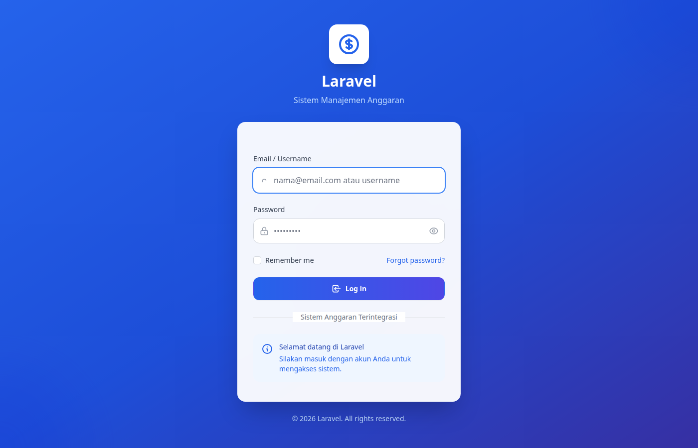

Halaman login untuk mengakses aplikasi dengan email/username dan password.

---

### 2. Dashboard

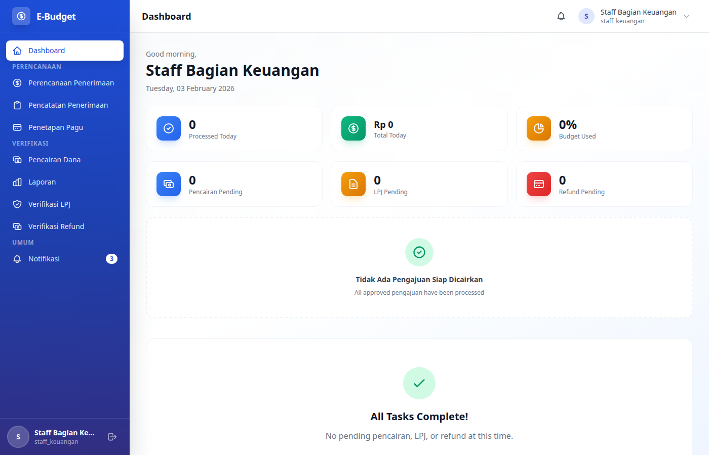

Tampilan dashboard utama dengan ringkasan statistik dan notifikasi.

---

### 3. Menu Navigasi

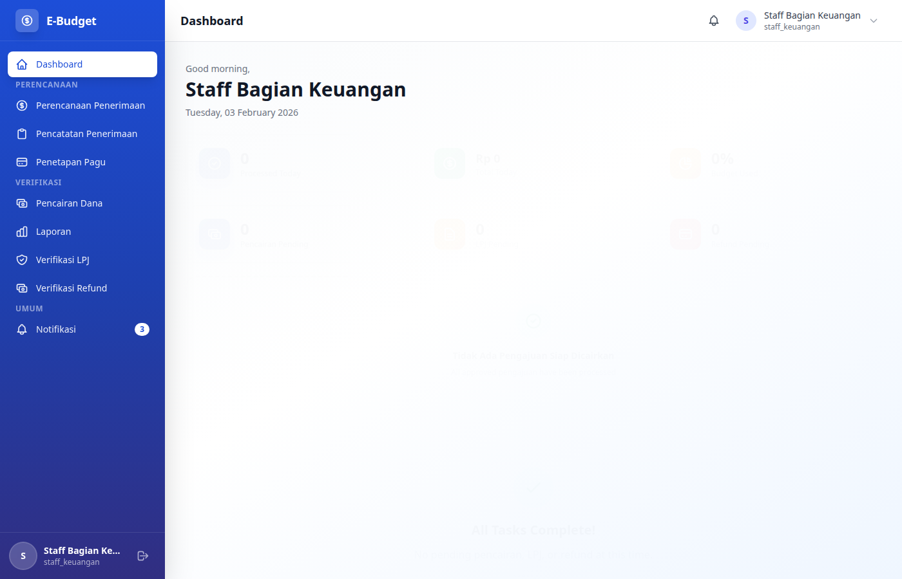

Menu navigasi samping untuk mengakses berbagai fitur aplikasi.

---

### 4. Periode Anggaran - Daftar

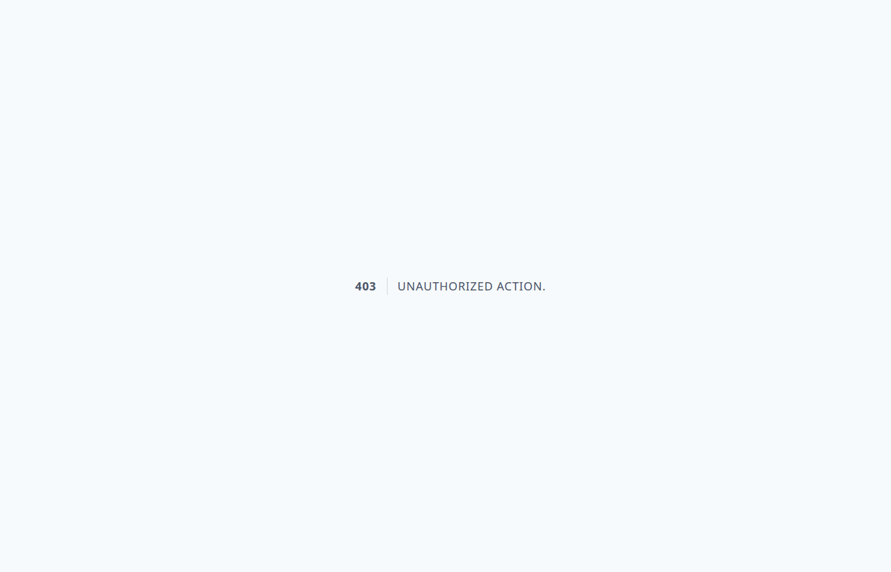

Halaman daftar periode anggaran dengan tombol aksi (tambah, edit, aktifkan, tutup).

---

### 5. Program Kerja - Daftar

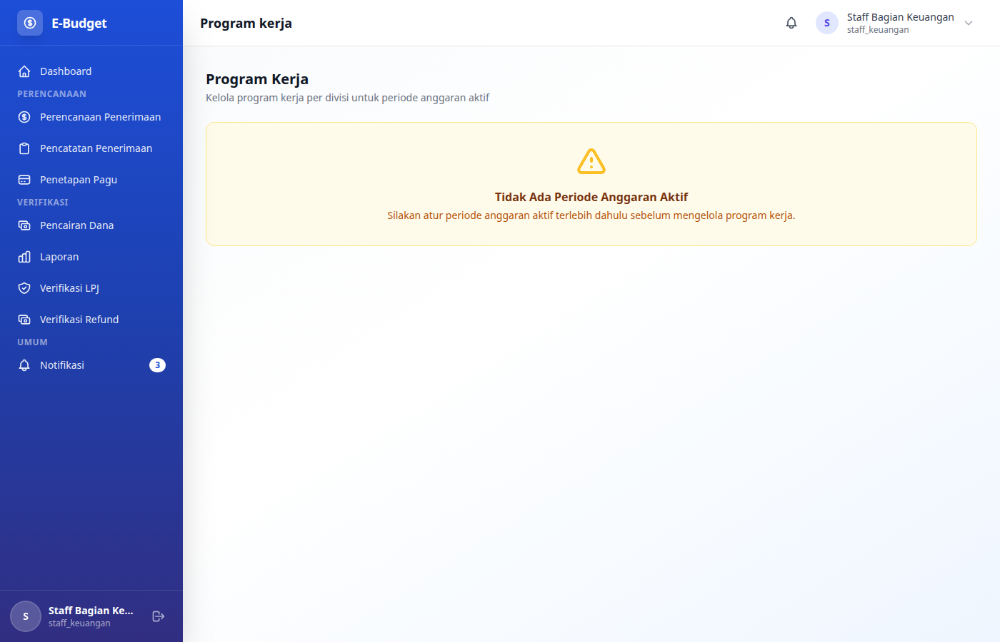

Halaman daftar program kerja dengan filter periode anggaran.

---

### 6. Pengajuan Dana - Daftar

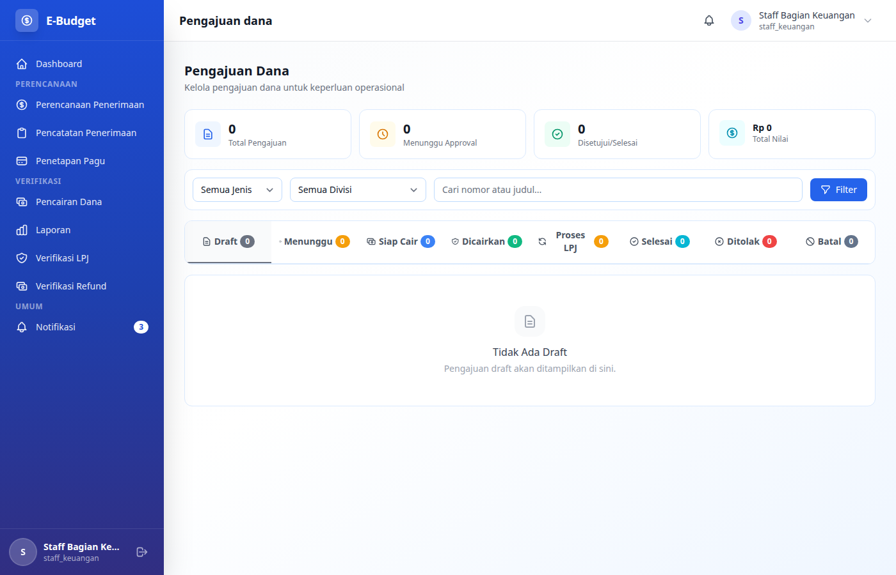

Halaman daftar pengajuan dana dengan status dan filter berdasarkan periode.

---

### 7. Pencairan Dana - Daftar

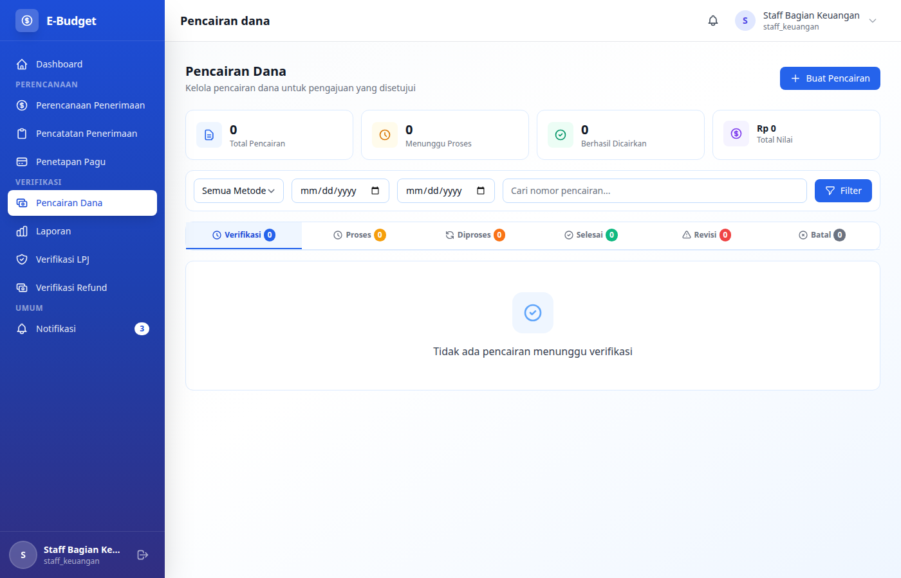

Halaman daftar pencairan dana dengan status proses pencairan.

---

### 8. LPJ - Daftar

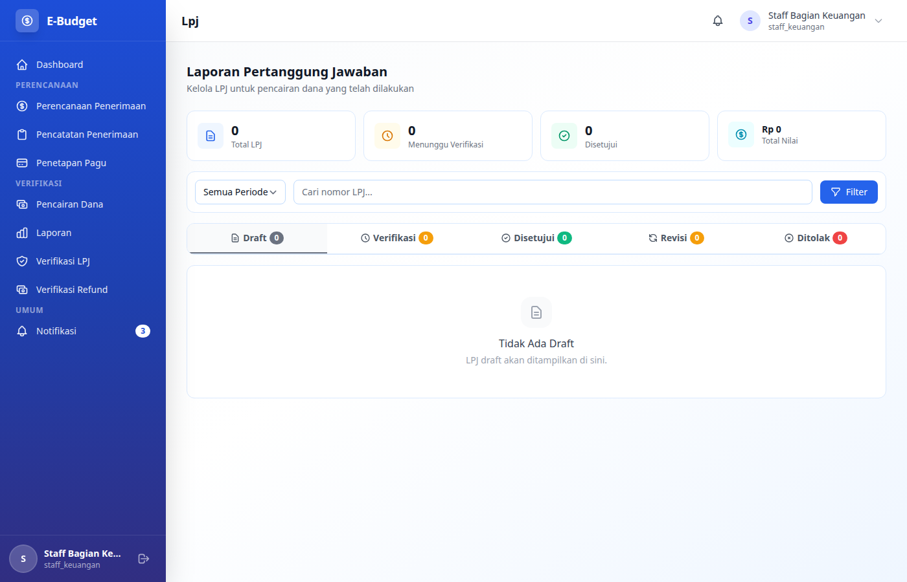

Halaman daftar Laporan Pertanggungjawaban dengan status verifikasi.

---

### 9. Refund - Daftar

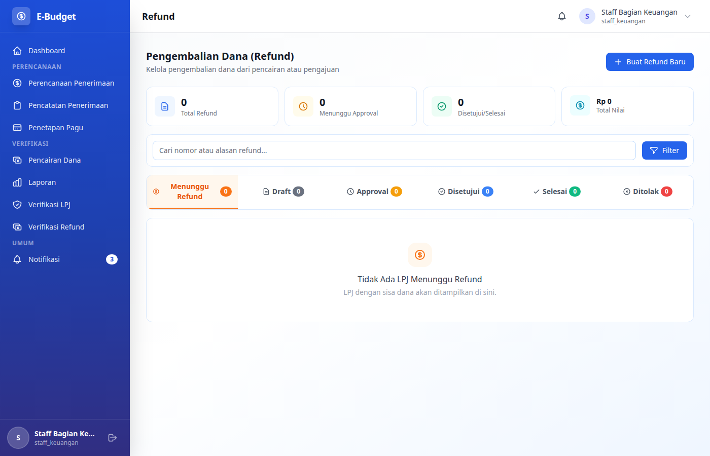

Halaman daftar refund dengan status pengembalian dana.

---

### 10. Approvals - Daftar

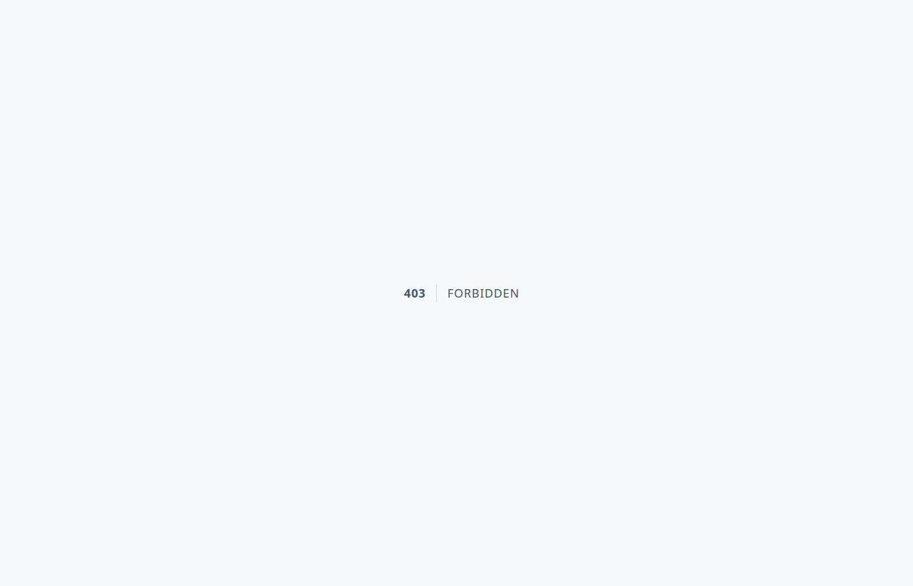

Halaman daftar approval yang menunggu proses persetujuan.

---

### 11. Profil Pengguna

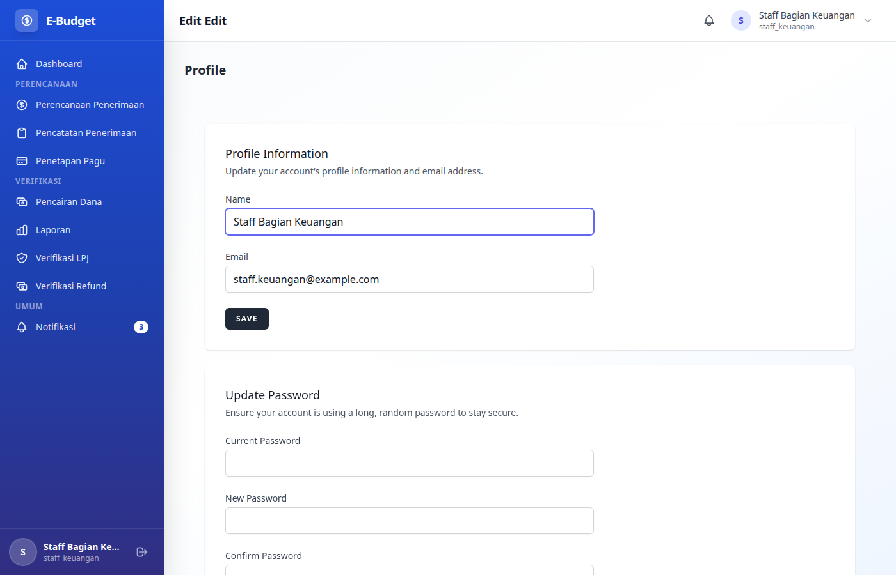

Halaman profil untuk mengedit data diri dan mengubah password.

---

## Pengambilan Screenshot

Screenshot diambil menggunakan Playwright dengan script di `tests/e2e/screenshots.spec.cjs`.

### Menjalankan ulang pengambilan screenshot:

```bash
npx playwright test tests/e2e/screenshots.spec.cjs
```

---

## Spesifikasi Screenshot

- **Resolution**: 1400 x 900 pixels
- **Format**: PNG
- **Mode**: Full Page
- **Browser**: Chromium (Headless)

---

## Lisensi

Screenshot ini adalah bagian dari dokumentasi eBudget Sederhana.
