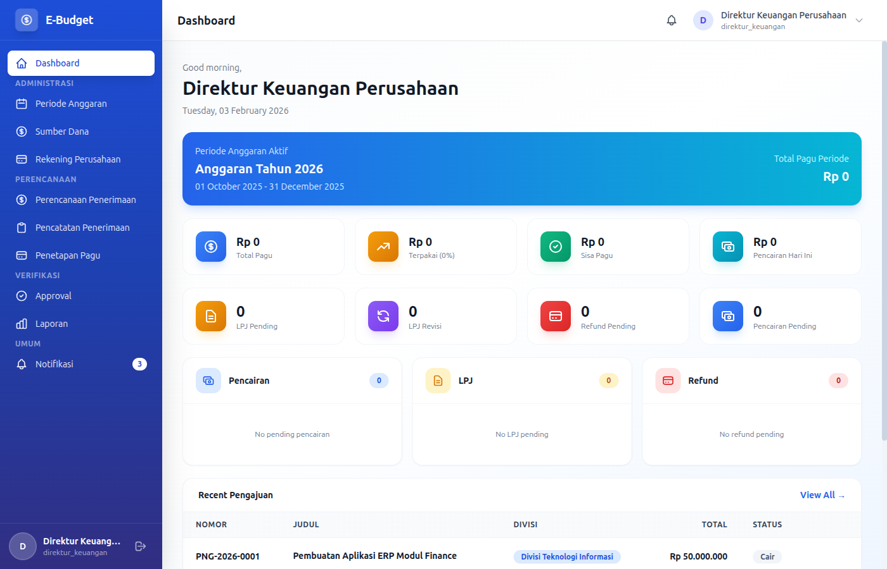
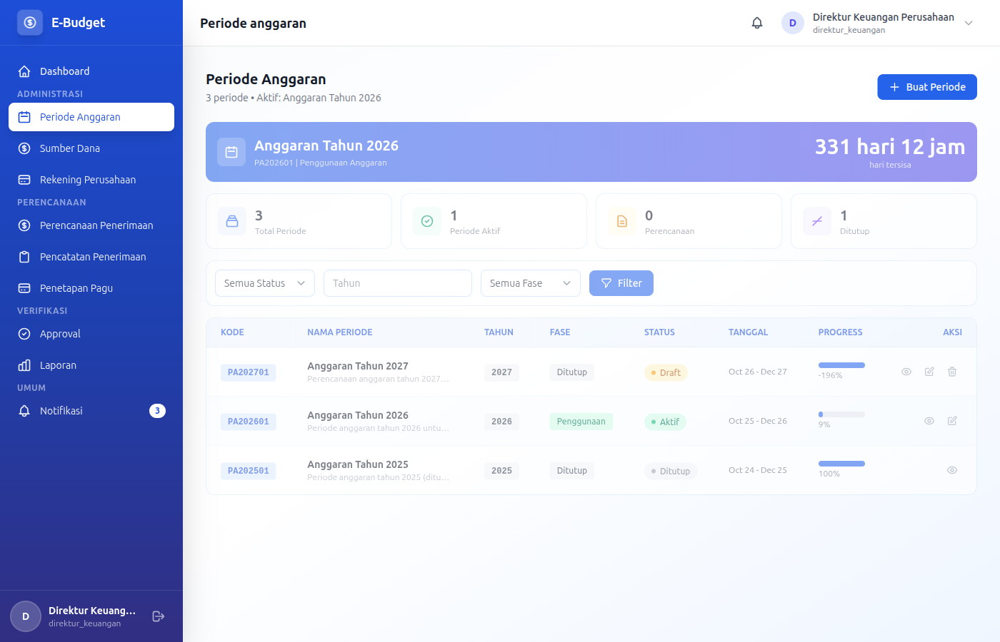
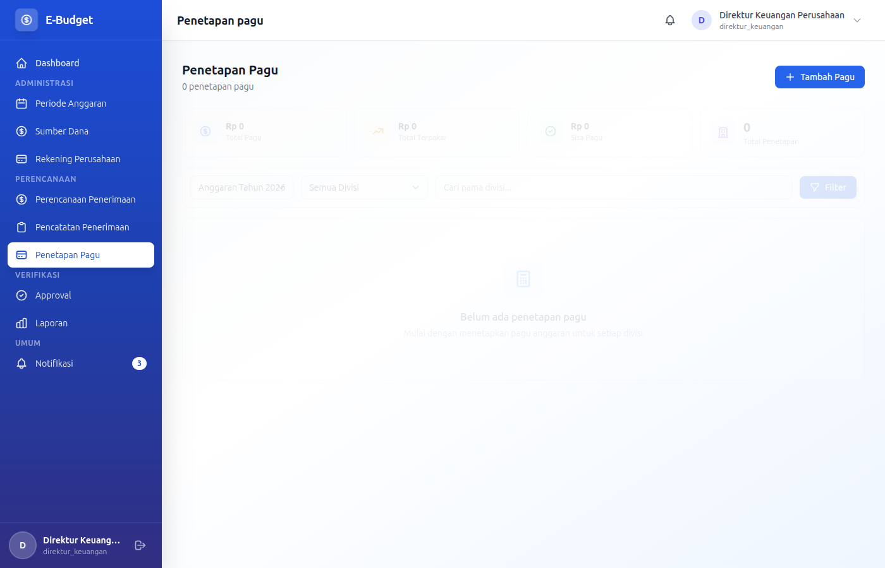

# eBudget Sederhana - Manual Direktur Keuangan

## Selamat Datang, Direktur Keuangan!

Sebagai **Direktur Keuangan**, Anda memiliki peran penting dalam perencanaan anggaran, penetapan pagu, dan oversight keuangan perusahaan. Dokumen ini akan memandu Anda.

---

## Daftar Isi

1. [Login & Dashboard](#login--dashboard)
2. [Periode Anggaran](#periode-anggaran)
3. [Penetapan Pagu](#penetapan-pagu)
4. [Program Kerja](#program-kerja)
5. [Monitoring & Approval](#monitoring--approval)
6. [Laporan Keuangan](#laporan-keuangan)

---

## Login & Dashboard

### Login ke Aplikasi

**Kredensial Login:**
- Email: `direktur@example.com`
- Password: `password`

### Dashboard Overview



Sebagai Direktur Keuangan, dashboard menampilkan:
- Ringkasan anggaran perusahaan
- Status periode anggaran aktif
- Statistik pagu yang sudah ditetapkan
- Notifikasi approval yang pending

---

## Periode Anggaran

### CRUD Periode Anggaran

Sebagai Direktur Keuangan, Anda memiliki akses penuh untuk **Create, Read, Update, Delete** periode anggaran.

### READ - Melihat Daftar Periode Anggaran

Periode Anggaran adalah timeframe untuk satu siklus anggaran perusahaan (biasanya 1 tahun).



1. Masuk ke menu **Periode Anggaran**
2. Daftar periode menampilkan:
   - Nama periode
   - Tahun anggaran
   - Tanggal mulai perencanaan
   - Tanggal selesai perencanaan
   - Tanggal mulai penggunaan
   - Tanggal selesai penggunaan
   - Status (Draft, Active, Closed)
   - Deskripsi

**Filter yang tersedia:**
- Filter berdasarkan status
- Filter berdasarkan tahun anggaran
- Search berdasarkan nama periode

**Status Periode:**
- **Draft**: Sedang disusun, belum aktif
- **Active**: Periode sedang berjalan
- **Closed**: Periode sudah ditutup

### CREATE - Membuat Periode Anggaran Baru

1. Masuk ke menu **Periode Anggaran**
2. Klik **Tambah Periode** / **Create Period**
3. Isi form:

**Informasi Dasar (Wajib):**
- **Nama Periode**: Nama periode (required, max 200 karakter)
  - Contoh: "Anggaran 2026", "TA 2026"
- **Tahun Anggaran**: Tahun anggaran (required, unique, min: 2020)
  - Contoh: "2026"
- **Deskripsi**: Deskripsi periode (optional, max 1000 karakter)

**Tanggal Perencanaan:**
- **Tanggal Mulai Perencanaan**: Tanggal mulai menyusun anggaran (required)
- **Tanggal Selesai Perencanaan**: Tanggal selesai menyusun anggaran (required)
  - Biasanya 2-3 bulan sebelum tahun anggaran

**Tanggal Penggunaan:**
- **Tanggal Mulai Penggunaan**: Tanggal mulai periode aktif (required)
- **Tanggal Selesai Penggunaan**: Tanggal selesai periode (required)
  - Biasanya 1 Januari - 31 Desember

4. Klik **Simpan** / **Save**

5. Sistem akan:
   - Membuat periode anggaran baru
   - Menetapkan status sebagai "Draft"
   - Menghitung durasi perencanaan dan penggunaan

**Validation:**
- Nama periode harus unik
- Tahun anggaran harus unik
- Tanggal selesai harus setelah tanggal mulai
- Tanggal perencanaan harus sebelum tanggal penggunaan

### UPDATE - Mengedit Periode Anggaran

1. Pada daftar Periode Anggaran, klik tombol **Edit** pada periode yang diinginkan
2. Form edit akan muncul dengan semua field

**Ketentuan Update:**
- **Status Draft**: Semua field bisa diedit
- **Status Active**: Hanya deskripsi dan tanggal yang bisa diedit (dengan batasan)
- **Status Closed**: Tidak bisa diedit sama sekali

3. Lakukan perubahan yang diperlukan
4. Klik **Update**

### UPDATE - Mengaktifkan Periode

Hanya satu periode yang dapat aktif dalam satu waktu:

1. Pastikan periode aktif saat ini sudah di-set ke "Closed"
2. Edit periode baru yang ingin diaktifkan
3. Ubah status menjadi "Active"
4. Klik **Update**

5. Sistem akan:
   - Menonaktifkan periode lain
   - Mengaktifkan periode yang dipilih
   - Memberikan notifikasi ke semua user

### UPDATE - Menutup Periode Anggaran

Setelah periode berakhir:

1. Edit periode yang akan ditutup
2. Ubah status menjadi "Closed"
3. Pastikan semua LPJ sudah disubmit (sistem akan memvalidasi)
4. Klik **Update**

**Validasi Penutupan:**
- Semua pengajuan harus sudah selesai (approved/rejected)
- Semua pencairan harus sudah diproses
- Semua LPJ harus sudah disubmit
- Tidak ada pengajuan pending

### DELETE - Menghapus Periode Anggaran

1. Klik tombol **Hapus** / **Delete** pada periode anggaran
2. Konfirmasi penghapusan

**Batasan Delete:**
- Hanya periode dengan status **Draft** bisa dihapus
- Tidak bisa menghapus periode yang sudah active
- Tidak bisa menghapus periode yang memiliki data terkait (program kerja, pengajuan, dll)

### SPECIAL OPERATIONS

**View Statistics:**
1. Klik tombol **Statistics** pada periode
2. Menampilkan:
   - Total pagu yang ditetapkan
   - Total realisasi
   - Jumlah pengajuan
   - Jumlah pencairan
   - Jumlah LPJ
   - Persentase realisasi

**Monthly Trend Analysis:**
1. Pilih periode anggaran
2. Klik **View Trend**
3. Menampilkan grafik tren bulanan

---

## Penetapan Pagu

### Apa itu Pagu Anggaran?

Pagu anggaran adalah alokasi dana maksimum yang diberikan kepada setiap divisi untuk periode tertentu.



### READ - Melihat Pagu Divisi

1. Masuk ke menu **Penetapan Pagu**
2. Daftar pagu menampilkan:
   - Nama divisi
   - Periode anggaran
   - Jumlah pagu yang ditetapkan
   - Total realisasi
   - Sisa pagu
   - Persentase penggunaan
   - Status (Aktif/Non-aktif)

**Filter yang tersedia:**
- Filter berdasarkan periode anggaran
- Filter berdasarkan divisi
- Filter berdasarkan status

### CREATE/UPDATE - Menetapkan Pagu Divisi

1. Masuk ke menu **Penetapan Pagu**
2. Pilih periode anggaran aktif
3. Untuk setiap divisi:

**Form Penetapan Pagu:**
- **Divisi**: Nama divisi (readonly)
- **Jumlah Pagu**: Masukkan pagu anggaran (required, numeric)
- **Catatan**: Berikan catatan (optional)
  - Alasan penetapan
  - Keterangan tambahan

4. Klik **Simpan** / **Update** untuk setiap divisi
5. Review total pagu semua divisi di bagian summary

**Validation:**
- Jumlah pagu harus lebih dari 0
- Total pagu semua divisi tidak melebihi kapasitas perusahaan
- Pagu minimal sesuai kebutuhan dasar divisi

### UPDATE - Mengubah Pagu

Pagu dapat diubah dengan ketentuan:

**Syarat Mengubah Pagu:**
- Periode anggaran masih aktif
- Belum ada realisasi yang melebihan dari pagu baru
- Untuk penurunan signifikan, butuh persetujuan Direktur Utama

**Cara Mengubah:**
1. Edit pagu divisi yang ingin diubah
2. Masukkan jumlah pagu baru
3. Isi alasan perubahan (wajib untuk penurunan)
4. Klik **Update**

5. Sistem akan:
   - Memvalidasi perubahan
   - Mencatat history perubahan
   - Mengirim notifikasi ke divisi terkait

### Prinsip Penetapan Pagu

1. **Historikal**: Berdasarkan realisasi tahun sebelumnya
2. **Proyeksi**: Mempertimbangkan rencana kerja setiap divisi
3. **Ketersediaan Dana**: Total pagu tidak melebihi kapasitas perusahaan
4. **Prioritas**: Memberikan alokasi lebih besar untuk divisi strategis

---

## Program Kerja

### READ - Melihat Program Kerja

Sebagai Direktur Keuangan, Anda dapat melihat semua program kerja untuk perencanaan anggaran.

1. Masuk ke menu **Program Kerja**
2. Daftar program kerja menampilkan:
   - Kode program
   - Nama program
   - Divisi pemilik
   - Periode anggaran
   - Status (active, inactive, suspended)
   - Total pagu
   - Sisa pagu
   - Target output

**Filter yang tersedia:**
- Filter berdasarkan divisi
- Filter berdasarkan status
- Filter berdasarkan periode anggaran
- Search berdasarkan nama/kode program

---

## Monitoring & Approval

### Tanggung Jawab Approval

Sebagai Direktur Keuangan, Anda bertanggung jawab atas:
- Pengajuan dana di atas threshold tertentu
- Pencairan dana dari rekening perusahaan
- Review LPJ keuangan
- Approval refund besar

### READ - Melihat Pending Approvals

1. Klik menu **Approvals**
2. Daftar approval menampilkan:
   - Nomor pengajuan
   - Judul pengajuan
   - Divisi pengaju
   - Jumlah dana
   - Jenis pengajuan
   - Status
   - Tanggal pengajuan

**Filter yang tersedia:**
- Filter berdasarkan status (Pending, Approved, Rejected)
- Filter berdasarkan jenis pengajuan
- Filter berdasarkan divisi
- Filter berdasarkan jumlah dana
- Search berdasarkan judul/nomor pengajuan

### UPDATE - Menyetujui Pengajuan (Approve)

1. Klik tombol **Setuju** / **Approve** pada pengajuan
2. Modal detail akan muncul
3. Review kembali detail:
   - Ketersediaan pagu divisi
   - Kebutuhan pengajuan
   - Kelengkapan dokumen
   - Kesesuaian dengan program kerja

4. Tambahkan catatan (opsional):
   - Alasan approval
   - Instruksi tambahan

5. Klik **Konfirmasi** / **Confirm Approval**

6. Sistem akan:
   - Mengupdate status pengajuan
   - Mengirim notifikasi ke pengaju
   - Mengirim email konfirmasi
   - Meneruskan ke level approval berikutnya (jika ada)

### UPDATE - Menolak Pengajuan (Reject)

1. Klik tombol **Tolak** / **Reject** pada pengajuan
2. Isi **alasan penolakan** (wajib):
   - Pagu tidak tersedia
   - Dokumen tidak lengkap
   - Tidak sesuai prioritas
   - Tidak mendesak
   - Lainnya (sebutkan)

3. Tambahkan catatan detail (opsional)
4. Klik **Konfirmasi Penolakan**

### BULK OPERATIONS

**Bulk Approval:**
1. Pilih pengajuan dengan checkbox
2. Klik **Setuju Terpilih**
3. Review dan konfirmasi

**Bulk Rejection:**
1. Pilih pengajuan dengan checkbox
2. Klik **Tolak Terpilih**
3. Isi alasan penolakan umum
4. Konfirmasi

---

## Laporan Keuangan

### READ - Akses Laporan

Anda memiliki akses ke:
- Laporan keuangan bulanan
- Laporan realisasi anggaran
- Laporan divisi
- Export laporan ke Excel/PDF

### Melihat Laporan

1. Klik menu **Reports**
2. Pilih jenis laporan:
   - **Laporan Keuangan**: Menampilkan semua transaksi keuangan
   - **Laporan Realisasi**: Perbandingan pagu vs realisasi
   - **Laporan Divisi**: Ringkasan per divisi

3. Pilih filter:
   - Periode anggaran
   - Divisi (opsional)
   - Jenis pengajuan (opsional)
   - Range tanggal (opsional)

4. Klik **Generate** / **Tampilkan**

### EXPORT - Export Laporan

1. Pilih laporan yang ingin di-export
2. Klik **Export** / **Download**
3. Pilih format:
   - **Excel** (.xlsx): Untuk analisis lebih lanjut
   - **PDF** (.pdf): Untuk print atau arsip

4. Pilih opsi export:
   - Include chart/grafik
   - Include detail breakdown
   - Format date

5. Klik **Generate Export**
6. File akan di-download otomatis

---

## Alur Kerja Keuangan

### Siklus Anggaran

```
Perencanaan → Penetapan Pagu → Pengajuan → Pencairan → Pelaksanaan → LPJ
```

### Peran Anda dalam Siklus

1. **Perencanaan**: Buat periode anggaran
2. **Penetapan**: Tetapkan pagu per divisi
3. **Pengajuan**: Review dan approve pengajuan
4. **Pencairan**: Berikan persetujuan pencairan
5. **LPJ**: Review pertanggungjawaban keuangan

---

## Tips untuk Direktur Keuangan

### Best Practices

1. **Review Pagu Secara Berkala**
   - Monitor realisasi vs pagu
   - Evaluasi sisa anggaran
   - Adjust jika perlu

2. **Approval yang Cermat**
   - Cek ketersediaan pagu sebelum approve
   - Review kebutuhan pengajuan
   - Pastikan kelengkapan dokumen

3. **Monitoring Aktif**
   - Review dashboard harian
   - Perhatikan pengajuan pending
   - Monitor penggunaan anggaran

4. **Komunikasi dengan Divisi**
   - Berikan update sisa anggaran
   - Info pengajuan yang approved/rejected
   - Koordinasi untuk penambahan pagu

---

## Troubleshooting

### Tidak Bisa Membuat Periode Baru

- Pastikan periode aktif sudah di-set ke "Selesai"
- Cek apakah ada periode lain yang sedang aktif
- Hubungi superadmin jika ada issue

### Pengajuan Tidak Muncul di Approvals

- Pastikan pengajuan sudah disubmit oleh divisi
- Cek level approval yang dilewati
- Hubungi admin jika ada issue

### Pagu Tidak Bisa Diubah

- Pastikan periode anggaran masih aktif
- Cek apakah ada realisasi yang melebihi pagu baru
- Hubungi superadmin untuk bantuan

### Tidak Bisa Menutup Periode

- Pastikan semua LPJ sudah disubmit
- Cek apakah ada pengajuan pending
- Selesaikan semua transaksi sebelum menutup

---

## Kewajiban Hukum

Sebagai Direktur Keuangan, Anda bertanggung jawab atas:
- Kepatuhan terhadap anggaran yang ditetapkan
- Keabsahan laporan keuangan
- Pertanggungjawaban penggunaan dana
- Kepatuhan regulasi keuangan

---

*Dokumentasi ini khusus untuk role Direktur Keuangan eBudget Sederhana*
*Versi: 1.0 | Terakhir update: Februari 2026*
