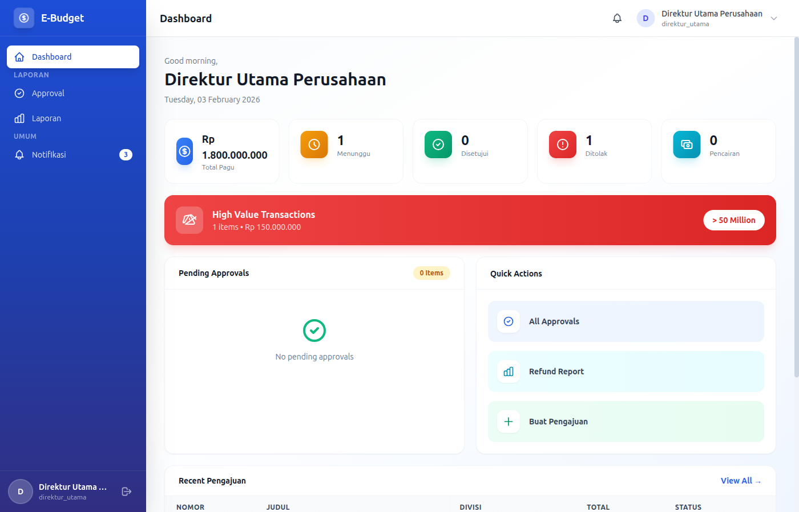
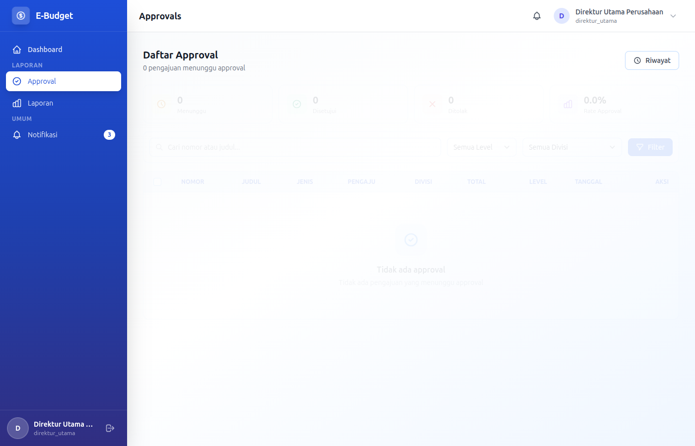

# eBudget Sederhana - Manual Direktur Utama

## Selamat Datang, Direktur Utama!

Sebagai **Direktur Utama**, Anda memiliki otoritas tertinggi dalam approval dan melihat laporan eksekutif. Dokumen ini akan memandu Anda.

---

## Daftar Isi

1. [Login & Dashboard](#login--dashboard)
2. [Sistem Approval](#sistem-approval)
3. [Laporan Eksekutif](#laporan-eksekutif)
4. [Monitoring Keuangan](#monitoring-keuangan)
5. [Manajemen User](#manajemen-user)
6. [Manajemen Divisi](#manajemen-divisi)

---

## Login & Dashboard

### Login ke Aplikasi

**Kredensial Login:**
- Email: `direktur.utama@example.com`
- Password: `password`

### Dashboard Overview



Sebagai Direktur Utama, dashboard menampilkan:
- Ringkasan anggaran perusahaan
- Statistik approval yang pending
- Status pengajuan dana besar
- Notifikasi penting

---

## Sistem Approval

### Daftar Approval



### Tanggung Jawab Approval

Sebagai Direktur Utama, Anda bertanggung jawab atas:
- Pengajuan dana di atas threshold tertentu
- Pencairan dana besar
- LPJ untuk kegiatan penting
- Approval level tertinggi

### READ - Melihat Pending Approvals

1. Klik menu **Approvals**
2. Daftar approval menampilkan:
   - Nomor pengajuan
   - Judul pengajuan
   - Divisi pengaju
   - Jumlah dana
   - Jenis pengajuan
   - Status approval saat ini
   - Tanggal pengajuan

**Filter yang tersedia:**
- Filter berdasarkan status (Pending, Approved, Rejected)
- Filter berdasarkan jenis pengajuan
- Filter berdasarkan divisi
- Filter berdasarkan jumlah dana
- Search berdasarkan judul/nomor pengajuan

**Status Group:**
- **Draft**: Belum disubmit
- **Menunggu Approval**: Menunggu persetujuan
- **Menunggu Pencairan**: Sudah disetujui, menunggu pencairan
- **Cair**: Dana sudah dicairkan
- **Proses**: Sedang diproses
- **Selesai**: Kegiatan selesai
- **Ditolak**: Ditolak
- **Cancelled**: Dibatalkan

### UPDATE - Menyetujui Pengajuan (Approve)

1. Klik tombol **Setuju** / **Approve** pada pengajuan
2. Modal detail akan muncul menampilkan:
   - Informasi pengajuan lengkap
   - Detail rincian penggunaan dana
   - Lampiran dokumen
   - History approval

3. Review kembali detail:
   - Judul dan deskripsi pengajuan
   - Program kerja terkait
   - Rincian penggunaan dana
   - Total pengajuan
   - Lampiran dokumen

4. Tambahkan catatan (opsional):
   - Alasan approval
   - Instruksi tambahan
   - Catatan untuk pencatatan

5. Klik **Konfirmasi** / **Confirm Approval**

6. Sistem akan:
   - Mengupdate status pengajuan
   - Mengirim notifikasi ke pengaju
   - Mengirim email konfirmasi
   - Meneruskan ke level approval berikutnya (jika ada)

### UPDATE - Menolak Pengajuan (Reject)

1. Klik tombol **Tolak** / **Reject** pada pengajuan
2. Modal penolakan akan muncul

3. Isi **alasan penolakan** (wajib):
   - Pilih alasan dari dropdown atau isi manual:
     - Pagu tidak tersedia
     - Dokumen tidak lengkap
     - Tidak sesuai prioritas
     - Tidak mendesak
     - Lainnya (sebutkan)

4. Tambahkan catatan detail (opsional)

5. Klik **Konfirmasi Penolakan** / **Confirm Rejection**

6. Sistem akan:
   - Mengupdate status pengajuan menjadi "Ditolak"
   - Mengirim notifikasi ke pengaju
   - Mengirim email penolakan dengan alasan
   - Pengaju dapat merevisi dan resubmit

### BULK APPROVAL - Menyetujui Banyak Pengajuan

Untuk menyetujui banyak pengajuan sekaligus:

1. Pada daftar Approvals, centang pengajuan yang ingin disetujui menggunakan checkbox
2. Klik tombol **Setuju Terpilih** / **Approve Selected**
3. Modal konfirmasi akan muncul menampilkan:
   - Jumlah pengajuan yang akan disetujui
   - Total dana yang akan disetujui
   - Daftar pengajuan yang dipilih

4. Review daftar pengajuan
5. Tambahkan catatan umum (opsional)
6. Klik **Konfirmasi Bulk Approval**

> **Peringatan:** Pastikan Anda sudah review semua pengajuan sebelum bulk approve.

### BULK REJECTION - Menolak Banyak Pengajuan

1. Pada daftar Approvals, centang pengajuan yang ingin ditolak
2. Klik tombol **Tolak Terpilih** / **Reject Selected**
3. Isi alasan penolakan umum
4. Klik **Konfirmasi**

### VIEW DETAIL - Melihat Detail Pengajuan

1. Klik judul atau nomor pengajuan
2. Halaman detail akan menampilkan:
   - **Informasi Umum**:
     - Nomor pengajuan
     - Judul pengajuan
     - Jenis pengajuan
     - Divisi pengaju
     - Tanggal pengajuan
     - Status

   - **Detail Pengajuan**:
     - Program kerja terkait
     - Deskripsi kegiatan
     - Total pengajuan
     - Rincian penggunaan dana (itemized)

   - **Dokumen Lampiran**:
     - Daftar lampiran yang diupload
     - Download/setiap lampiran

   - **History Approval**:
     - Siapa saja yang sudah approve
     - Tanggal approval
     - Catatan dari setiap approver

---

## Laporan Eksekutif

### READ - Akses Laporan

Anda memiliki akses ke:
- Laporan keuangan bulanan
- Laporan realisasi anggaran
- Laporan divisi
- Export laporan ke Excel/PDF

### Melihat Laporan

1. Klik menu **Reports**
2. Pilih jenis laporan:
   - **Laporan Keuangan**: Menampilkan semua transaksi keuangan
   - **Laporan Divisi**: Ringkasan per divisi
   - **Laporan Eksekutif**: Laporan summary untuk top management
   - **Laporan Realisasi**: Perbandingan pagu vs realisasi

3. Pilih filter:
   - Periode anggaran
   - Divisi (opsional)
   - Jenis pengajuan (opsional)
   - Range tanggal (opsional)

4. Klik **Generate** / **Tampilkan**

5. Laporan akan menampilkan:
   - Summary statistik
   - Tabel detail data
   - Grafik dan chart (jika tersedia)

### EXPORT - Export Laporan

1. Pilih laporan yang ingin di-export
2. Klik **Export** / **Download**
3. Pilih format:
   - **Excel** (.xlsx): Untuk analisis lebih lanjut
   - **PDF** (.pdf): Untuk print atau arsip

4. Pilih opsi export:
   - Include chart/grafik
   - Include detail breakdown
   - Format date

5. Klik **Generate Export**

6. File akan di-download otomatis

---

## Monitoring Keuangan

### Ringkasan Keuangan

Anda dapat memantau dari Dashboard:
- **Total Pagu Anggaran**: Jumlah total pagu perusahaan
- **Total Terealisasi**: Jumlah yang sudah digunakan
- **Sisa Anggaran**: Pagu - Realisasi
- **Pengajuan Pending**: Jumlah pengajuan yang menunggu approval

### Review Pengajuan Besar

Pengajuan dengan jumlah besar akan memerlukan approval Anda:

**Threshold Approval:**
| Jenis Transaksi | Threshold | Approval Anda |
|-----------------|-----------|---------------|
| Pengajuan Dana | > 100 juta | Wajib approve |
| Pencairan Dana | > 50 juta | Wajib approve |
| LPJ Kegiatan Khusus | Semua | Review |
| Refund | > 20 juta | Review |

**Review Pengajuan:**
1. Perhatikan pengajuan di atas threshold
2. Review kebutuhan dan kepentingan
3. Pastikan ada cukup pagu anggaran
4. Cek kelengkapan dokumen
5. Pertimbangkan dampak strategis

---

## Manajemen User

### CRUD User

Sebagai Direktur Utama, Anda memiliki akses untuk **Create, Read, Update, Delete** user.

### READ - Melihat Daftar User

1. Masuk ke menu **Users** (melalui Settings)
2. Daftar user menampilkan:
   - Nama lengkap
   - Username
   - Email
   - Role(s)
   - Divisi (jika applicable)
   - Status aktif/tidak
   - Tanggal dibuat

**Filter yang tersedia:**
- Filter berdasarkan role
- Filter berdasarkan divisi
- Search berdasarkan nama/email
- Filter berdasarkan status

### CREATE - Menambah User Baru

1. Masuk ke menu **Users**
2. Klik **Tambah User**
3. Isi form:

**Informasi Dasar (Wajib):**
- **Nama Lengkap**: Nama lengkap user (required)
- **Full Name**: Nama untuk tampilan (required)
- **Username**: Unique untuk login (optional)
- **Email**: Email unik untuk login (required)
- **Password**: Min 8 karakter (required)

**Role & Divisi:**
- **Role(s)**: Pilih satu atau lebih role
- **Divisi(s)**: Pilih divisi untuk role staff_divisi

4. Klik **Simpan**

### UPDATE - Mengedit User

1. Klik tombol **Edit** pada user
2. Ubah informasi yang diperlukan
3. Klik **Update**

### DELETE - Menghapus User

1. Klik tombol **Hapus** pada user
2. Konfirmasi penghapusan

> **Peringatan:** Tidak bisa menghapus user yang memiliki data terkait.

---

## Manajemen Divisi

### CRUD Divisi

Sebagai Direktur Utama, Anda memiliki akses untuk **Create, Read, Update, Delete** divisi.

### READ - Melihat Daftar Divisi

1. Masuk ke menu **Divisi**
2. Daftar divisi menampilkan:
   - Kode divisi
   - Nama divisi
   - Singkatan
   - Deskripsi
   - Jumlah user

### CREATE - Menambah Divisi Baru

1. Masuk ke menu **Divisi**
2. Klik **Tambah Divisi**
3. Isi form:
   - **Kode Divisi**: Kode unik (required)
   - **Nama Divisi**: Nama lengkap (required)
   - **Singkatan**: Singkatan (optional)
   - **Deskripsi**: Deskripsi (optional)

4. Klik **Simpan**

### UPDATE - Mengedit Divisi

1. Klik **Edit** pada divisi
2. Ubah nama divisi
3. Klik **Update**

### DELETE - Menghapus Divisi

1. Klik **Hapus** pada divisi
2. Konfirmasi penghapusan

> **Peringatan:** Tidak bisa menghapus divisi yang memiliki user atau data terkait.

---

## Alur Kerja Approval

### Level Approval

```
Staff Divisi → Kepala Divisi → [Direktur Keuangan] → Direktur Utama (Anda)
```

### Kapan Anda Perlu Approval

| Jenis Transaksi | Threshold | Keterlibatan Anda |
|-----------------|-----------|-------------------|
| Pengajuan Dana | > 100 juta | Wajib approve |
| Pengajuan Dana | 50-100 juta | Review (optional) |
| Pengajuan Dana | < 50 juta | Tidak perlu |
| Pencairan Dana | > 50 juta | Wajib approve |
| Pencairan Dana | < 50 juta | Tidak perlu |
| LPJ Kegiatan Khusus | Semua | Review |
| Refund | > 20 juta | Review |
| Refund | < 20 juta | Tidak perlu |

---

## Tips untuk Direktur Utama

### Best Practices

1. **Review Sebelum Approve**
   - Baca detail pengajuan dengan teliti
   - Pastikan kebutuhan mendesak
   - Cek ketersediaan anggaran

2. **Catatan Approval**
   - Tambahkan catatan untuk penolakan
   - Dokumentasikan alasan approval besar
   - Berikan instruksi jika perlu

3. **Monitoring Rutin**
   - Review dashboard harian
   - Perhatikan pengajuan pending
   - Cek realisasi anggaran

4. **Keputusan Strategis**
   - Gunakan laporan eksekutif
   - Analisis tren pengeluaran
   - Buat keputusan berbasis data

---

## Troubleshooting

### Pengajuan Tidak Muncul di Approvals

- Pastikan pengajuan sudah disubmit
- Cek level approval yang dilewati
- Hubungi admin jika ada issue

### Tidak Bisa Approve

- Pastikan Anda login sebagai direktur_utama
- Refresh halaman approvals
- Cek status pengajuan (mungkin sudah di-approve)

### Tidak Bisa Menghapus User

- User mungkin memiliki data terkait
- Non-aktifkan user sebagai alternatif

---

## Kewajiban Hukum

Sebagai Direktur Utama, Anda bertanggung jawab atas:
- Kepatuhan terhadap anggaran yang disetujui
- Keabsahan laporan keuangan
- Pertanggungjawaban penggunaan dana
- Kepatuhan regulasi keuangan

---

*Dokumentasi ini khusus untuk role Direktur Utama eBudget Sederhana*
*Versi: 1.0 | Terakhir update: Februari 2026*
