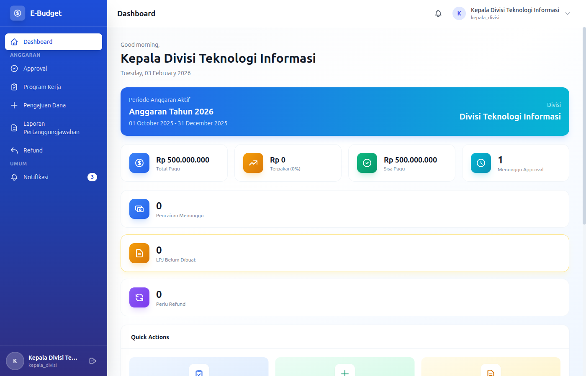
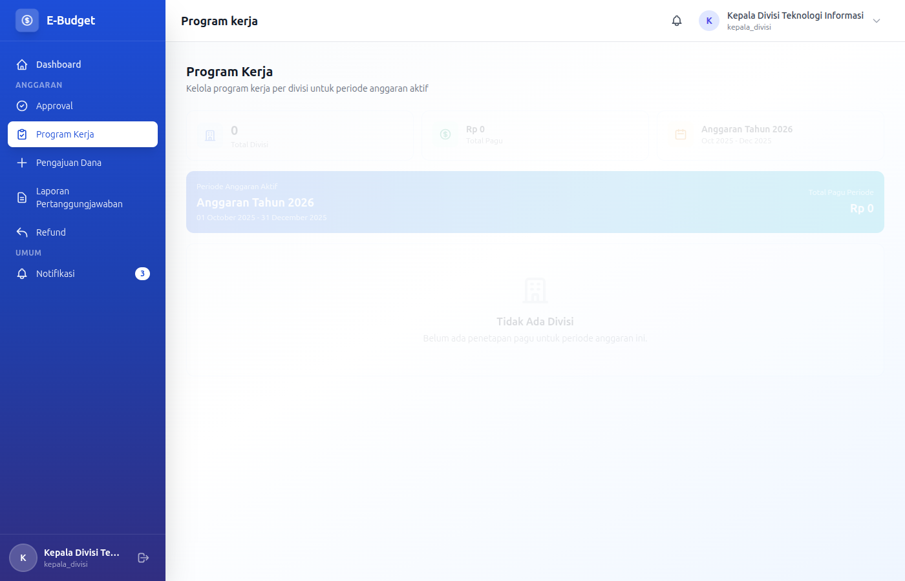
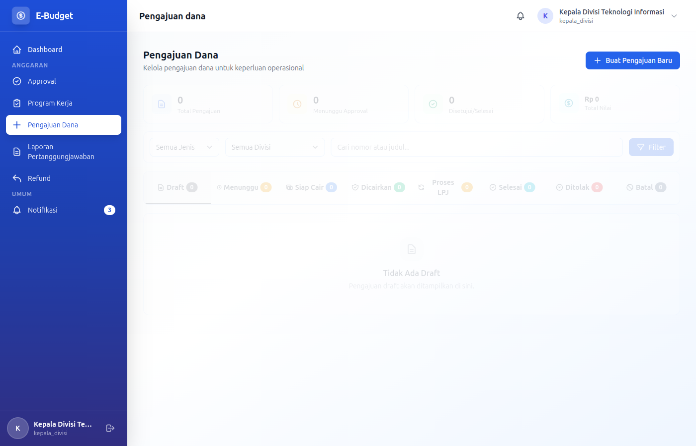
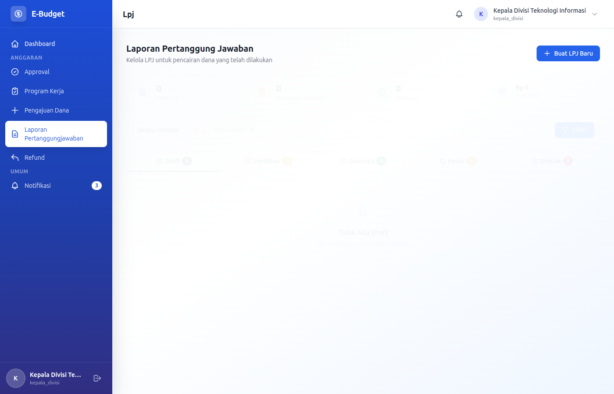

# eBudget Sederhana - Manual Kepala Divisi

## Selamat Datang, Kepala Divisi!

Sebagai **Kepala Divisi**, Anda adalah manager utama divisi yang bertanggung jawab atas perencanaan program kerja, pengajuan dana, dan pertanggungjawaban kegiatan divisi Anda. Dokumen ini akan memandu Anda.

---

## Daftar Isi

1. [Login & Dashboard](#login--dashboard)
2. [Program Kerja](#program-kerja)
3. [Pengajuan Dana](#pengajuan-dana)
4. [Laporan Pertanggungjawaban](#laporan-pertanggungjawaban)
5. [Refund](#refund)
6. [Approval Tim](#approval-tim)

---

## Login & Dashboard

### Login ke Aplikasi

**Kredensial Login:**
- Email: `kepala.[divisi]@example.com` (contoh: kepala.it@example.com)
- Password: `password`

### Dashboard Overview



Sebagai Kepala Divisi, dashboard menampilkan:
- Ringkasan pagu anggaran divisi Anda
- Status realisasi anggaran
- Daftar pengajuan pending dari staff
- Status program kerja divisi
- Notifikasi penting

---

## Program Kerja

### CRUD Program Kerja

Sebagai Kepala Divisi, Anda memiliki akses untuk **Create, Read, Update, Delete** program kerja divisi Anda.

### READ - Melihat Program Kerja

Program Kerja (Proker) adalah rencana kegiatan yang akan dilaksanakan oleh divisi dalam satu periode anggaran.



1. Masuk ke menu **Program Kerja**
2. Daftar program kerja menampilkan:
   - Kode program
   - Nama program
   - Periode anggaran
   - Target output
   - Status (active, inactive, suspended)
   - Total pagu
   - Sisa pagu
   - Tanggal mulai & selesai

**Filter yang tersedia:**
- Filter berdasarkan status
- Filter berdasarkan periode anggaran
- Search berdasarkan nama/kode program

**Status Program:**
- **Active**: Program sedang berjalan
- **Inactive**: Program belum/tidak aktif
- **Suspended**: Program ditangguhkan

### CREATE - Membuat Program Kerja Baru

1. Masuk ke menu **Program Kerja**
2. Klik **Tambah Program Kerja** / **Create Program**
3. Isi form:

**Informasi Dasar (Wajib):**
- **Kode Program**: Kode unik untuk program (required, unique)
  - Contoh: "PROG-IT-001", "TRAINING-2026"
- **Nama Program**: Nama lengkap program (required, max 255 karakter)
- **Divisi**: Otomatis terisi dengan divisi Anda (readonly)
- **Periode Anggaran**: Pilih periode anggaran aktif (required)

**Detail Program:**
- **Target Output**: Target yang ingin dicapai (optional)
- **Tanggal Mulai**: Perkiraan tanggal mulai (optional)
- **Tanggal Selesai**: Perkiraan tanggal selesai (optional)
- **Deskripsi**: Deskripsi program (optional)

4. Klik **Simpan** / **Save**

**Validation:**
- Kode program harus unik di seluruh sistem
- Nama program harus diisi
- Periode anggaran harus dipilih

### UPDATE - Mengedit Program Kerja

1. Pada daftar Program Kerja, klik tombol **Edit** pada program yang diinginkan
2. Form edit akan muncul

**Ketentuan Update:**
- Program hanya bisa diedit pada periode perencanaan
- Program tidak bisa diedit saat periode penggunaan sudah aktif
- Status program bisa diubah kapan saja

3. Lakukan perubahan yang diperlukan
4. Klik **Update**

### DELETE - Menghapus Program Kerja

1. Klik tombol **Hapus** / **Delete** pada program kerja
2. Konfirmasi penghapusan

**Batasan Delete:**
- Hanya program tanpa data terkait yang bisa dihapus
- Tidak bisa menghapus program yang sudah ada pengajuan dana
- Tidak bisa menghapus program yang sudah ada detail anggaran

> **Peringatan:** Program kerja yang sudah terkait dengan pengajuan dana tidak dapat dihapus.

### SPECIAL OPERATIONS

**Activate Program:**
1. Klik tombol **Activate** pada program
2. Program akan menjadi aktif dan bisa digunakan untuk pengajuan

**Suspend Program:**
1. Klik tombol **Suspend** pada program
2. Program akan ditangguhkan dan tidak bisa digunakan untuk pengajuan baru

**View Details:**
1. Klik nama program untuk melihat detail
2. Menampilkan:
   - Informasi lengkap program
   - Daftar pengajuan terkait
   - Realisasi anggaran
   - Progress achievement

### Tips Program Kerja yang Baik

1. **Spesifik**: Jelas dan terukur
2. **Realistis**: Sesuai dengan kapasitas dan sumber daya
3. **Prioritas**: Fokus pada kegiatan penting
4. **Terjadwal**: Ada timeline yang jelas

---

## Pengajuan Dana

### CRUD Pengajuan Dana

Sebagai Kepala Divisi, Anda dapat **Create, Read, Update** pengajuan dana untuk divisi Anda. Delete hanya untuk draft.

### READ - Melihat Daftar Pengajuan Dana

Pengajuan dana adalah permintaan dana untuk melaksanakan program kerja yang sudah direncanakan.



1. Masuk ke menu **Pengajuan Dana**
2. Daftar pengajuan menampilkan:
   - Nomor pengajuan
   - Judul pengajuan
   - Program kerja terkait
   - Jenis pengajuan
   - Total pengajuan
   - Status
   - Tanggal pengajuan

**Filter yang tersedia:**
- Filter berdasarkan status
- Filter berdasarkan jenis pengajuan
- Filter berdasarkan program kerja
- Search berdasarkan judul/nomor pengajuan

**Status Pengajuan:**
| Status | Keterangan |
|--------|------------|
| **Draft** | Belum disubmit, masih bisa diedit |
| **Menunggu Approval** | Menunggu persetujuan |
| **Menunggu Pencairan** | Disetujui, menunggu pencairan |
| **Cair** | Dana sudah dicairkan |
| **Proses** | Sedang diproses |
| **Selesai** | Kegiatan selesai |
| **Ditolak** | Ditolak, perlu revisi |
| **Revisi** | Perlu direvisi sesuai catatan |
| **Cancelled** | Dibatalkan |

### CREATE - Membuat Pengajuan Dana Baru

1. Masuk ke menu **Pengajuan Dana**
2. Klik **Ajukan Dana Baru** / **Create Request**
3. Isi form:

**Informasi Dasar (Wajib):**
- **Judul Pengajuan**: Judul kegiatan (required)
- **Jenis Pengajuan**: Pilih jenis (required):
  - `kegiatan` - Kegiatan operasional
  - `pengadaan` - Pengadaan barang/jasa
  - `pembayaran` - Pembayaran tagihan
  - `honorarium` - Honorarium narasumber/tenaga ahli
  - `sewa` - Sewa tempat/peralatan
  - `konsumsi` - Konsumsi kegiatan
  - `reimbursement` - Penggantian biaya
  - `lainnya` - Lain-lain

- **Program Kerja**: Pilih program terkait (required)
- **Deskripsi**: Jelaskan detail kegiatan (required)

**Penerima Manfaat:**
- **Nama Penerima**: Nama penerima dana (jika applicable)
- **Detail Penerima**: Informasi penerima (optional)

**Rincian Penggunaan Dana:**
Klik **+ Tambah Rincian** untuk setiap item:

- **Uraian**: Deskripsi item (required)
- **Volume**: Jumlah yang dibutuhkan (required, numeric)
- **Satuan**: Satuan (pcs, kg, orang, dll) (required)
- **Harga Satuan**: Harga per unit (required, numeric)
- **Subtotal**: Otomatis dihitung (volume × harga satuan)

Total pengajuan akan dihitung otomatis dari semua rincian.

**Lampiran Dokumen:**
Upload dokumen pendukung (max 5 files):
- **Proposal kegiatan** (PDF) - required untuk kegiatan
- **Quotation/Price list** (PDF/JPG) - required untuk pengadaan
- **Surat undangan** (PDF) - jika applicable
- **Dokumen lain** (PDF/Excel/JPG) - optional

4. Klik **Simpan sebagai Draft** atau **Submit**

**Validation:**
- Minimal 1 rincian penggunaan dana
- Total pengajuan minimal Rp 1.000
- Dokumen pendukung sesuai jenis pengajuan

### UPDATE - Mengedit Pengajuan Draft

Pengajuan dengan status **Draft** atau **Revisi** dapat diedit:

1. Klik tombol **Edit** pada pengajuan draft/revisi
2. Ubah informasi yang diperlukan:
   - Judul dan deskripsi
   - Jenis pengajuan
   - Program kerja
   - Rincian penggunaan dana (tambah/edit/hapus)
   - Lampiran (tambah/hapus)

3. Klik **Update**

### SPECIAL OPERATIONS

**Submit untuk Approval:**
1. Pastikan pengajuan sudah lengkap
2. Klik tombol **Submit**
3. Sistem akan memvalidasi:
   - Kelengkapan data
   - Ketersediaan pagu anggaran
   - Pending LPJ refund (jika ada)

4. Jika valid, pengajuan akan masuk ke alur approval

**Cancel Pengajuan (Draft/Menunggu):**
1. Klik tombol **Cancel** pada pengajuan
2. Konfirmasi pembatalan
3. Pengajuan akan berstatus "Cancelled"

**Print Pengajuan:**
1. Klik tombol **Print** pada pengajuan
2. PDF akan di-download
3. Bisa digunakan untuk arsip atau dokumen fisik

---

## Laporan Pertanggungjawaban

### CRUD LPJ

Sebagai Kepala Divisi, Anda dapat **Create, Read, Update** LPJ untuk divisi Anda. Delete hanya untuk draft.

### READ - Melihat Daftar LPJ

LPJ (Laporan Pertanggungjawaban) adalah dokumen yang menjelaskan penggunaan dana yang sudah dicairkan beserta bukti-bukti pengeluaran.



1. Masuk ke menu **LPJ**
2. Daftar LPJ menampilkan:
   - Nomor LPJ
   - Judul laporan
   - Pengajuan terkait
   - Total digunakan
   - Sisa dana
   - Status
   - Tanggal submit

**Filter yang tersedia:**
- Filter berdasarkan status
- Filter berdasarkan periode anggaran
- Filter berdasarkan program kerja
- Search berdasarkan judul/nomor LPJ

**Status LPJ:**
| Status | Keterangan |
|--------|------------|
| **Draft** | Belum disubmit |
| **Pending** | Menunggu verifikasi |
| **Approved** | Disetujui |
| **Revisi** | Perlu diperbaiki |
| **Rejected** | Ditolak |

### Kapan Harus Membuat LPJ?

LPJ harus dibuat setelah:
- Dana berhasil dicairkan
- Kegiatan selesai dilaksanakan
- Semua transaksi terdokumentasi

### CREATE - Membuat LPJ Baru

1. Masuk ke menu **LPJ**
2. Klik **Buat LPJ Baru** / **Create LPJ**
3. Pilih Pencairan Dana terkait dari dropdown (required)
4. Isi form:

**Informasi LPJ:**
- **Judul Laporan**: Judul laporan (required)
- **Uraian Kegiatan**: Jelaskan pelaksanaan kegiatan (optional)
  - Tanggal dan lokasi pelaksanaan
  - Jumlah peserta
  - Aktivitas yang dilakukan
  - Hasil yang dicapai

**Realisasi Pengeluaran:**
- **Total Digunakan**: Jumlah yang benar-benar digunakan (required, numeric, min: 0)
- **Sisa Dana**: Jumlah sisa (required, numeric, min: 0)
  - Otomatis dihitung: Jumlah Pencairan - Total Digunakan

**Rincian Realisasi:**
Klik **+ Tambah Rincian** untuk setiap item:

- **Detail Pencairan**: Pilih detail pencairan terkait (required)
- **Uraian**: Deskripsi item realisasi (required)
- **Tanggal Realisasi**: Tanggal pengeluaran (required)
- **Volume Realisasi**: Jumlah aktual (required, numeric)
- **Harga Satuan**: Harga aktual (required, numeric)
- **Subtotal**: Otomatis dihitung

**Upload Bukti Pengeluaran per Rincian:**
- Klik tombol upload pada setiap rincian
- Upload bukti pengeluaran (PDF/JPG/PNG)

**Penanganan Sisa Dana (jika ada):**
Jika ada sisa dana:
- **Jenis Penanganan**: Pilih opsi:
  - `Kembalikan ke Kas` - Dana dikembalikan
  - `Tambah ke LPJ Berikutnya` - Dipakai untuk kegiatan lain

- **Bukti Pengembalian**: Upload bukti (jika mengembalikan)

5. Klik **Simpan sebagai Draft** atau **Submit**

**Validation:**
- Total digunakan tidak boleh melebihi jumlah pencairan
- Semua rincian harus ada bukti pengeluaran
- Sisa dana harus sesuai perhitungan

### UPDATE - Mengedit LPJ Draft/Revisi

LPJ dengan status **Draft** atau **Revisi** dapat diedit:

1. Klik tombol **Edit** pada LPJ
2. Lakukan perubahan:
   - Judul dan uraian
   - Total digunakan dan sisa dana
   - Rincian realisasi
   - Bukti pengeluaran
   - Penanganan sisa dana

3. Klik **Update**

### SPECIAL OPERATIONS

**Submit untuk Verifikasi:**
1. Pastikan LPJ sudah lengkap
2. Klik tombol **Submit**
3. LPJ akan masuk ke verifikasi Direktur Keuangan/Staff Keuangan

**Print LPJ:**
1. Klik tombol **Print** pada LPJ
2. PDF akan di-download

---

## Refund

### CRUD Refund

Sebagai Kepala Divisi, Anda dapat **Create, Read, Update** refund untuk divisi Anda.

### READ - Melihat Daftar Refund

1. Masuk ke menu **Refund**
2. Daftar refund menampilkan:
   - Nomor refund
   - LPJ terkait
   - Jumlah refund
   - Alasan refund
   - Status
   - Tanggal pengajuan

**Status Refund:**
| Status | Keterangan |
|--------|------------|
| **Draft** | Belum disubmit |
| **Pending** | Menunggu proses |
| **Approved** | Disetujui |
| **Processed** | Sudah ditransfer |
| **Rejected** | Ditolak |

### CREATE - Membuat Refund Baru

1. Masuk ke menu **Refund**
2. Klik **Ajukan Refund Baru**
3. Pilih LPJ dengan sisa dana
4. Isi form:
   - Jumlah refund (required)
   - Alasan refund (required)
   - Metode refund: transfer/tunai
   - Detail rekening (jika transfer)

5. Klik **Submit**

### UPDATE - Mengedit Refund Draft

1. Klik tombol **Edit** pada refund draft
2. Lakukan perubahan
3. Klik **Update**

---

## Approval Tim

### Tanggung Jawab Approval

Sebagai Kepala Divisi, Anda adalah level pertama approval untuk:
- Pengajuan dana dari staff divisi
- LPJ dari staff divisi
- Permintaan refund

### Alur Approval

```
Staff Divisi → [Kepala Divisi (Anda)] → Direktur Keuangan → Direktur Utama
```

### READ - Melihat Daftar Approval

1. Klik menu **Approvals**
2. Daftar approval menampilkan:
   - Jenis (Pengajuan/LPJ/Refund)
   - Judul/Nomor
   - Staff pengaju
   - Jumlah dana
   - Status
   - Tanggal pengajuan

**Filter yang tersedia:**
- Filter berdasarkan status (Pending, Approved, Rejected)
- Filter berdasarkan jenis
- Filter berdasarkan staff yang mengajukan

### UPDATE - Menyetujui Pengajuan Staff (Approve)

1. Klik tombol **Setuju** / **Approve** pada pengajuan staff
2. Modal detail akan muncul
3. Review detail pengajuan:
   - Kecukupan dana yang diminta
   - Kesesuaian dengan program kerja
   - Kelengkapan dokumen
   - Justifikasi pengajuan

4. Tambahkan catatan (opsional):
   - Alasan approval
   - Instruksi tambahan
   - Catatan untuk staff

5. Klik **Konfirmasi** / **Confirm Approval**

6. Sistem akan:
   - Mengupdate status pengajuan
   - Mengirim notifikasi ke staff
   - Meneruskan ke level approval berikutnya (jika perlu)

### UPDATE - Menolak/Minta Revisi Pengajuan Staff (Reject)

1. Klik tombol **Tolak** / **Request Revision** pada pengajuan staff
2. Isi **alasan penolakan/revisi** (wajib):
   - Dana tidak mencukupi
   - Dokumen tidak lengkap
   - Tidak sesuai program kerja
   - Perlu clarification
   - Lainnya (sebutkan)

3. Pilih aksi:
   - **Tolak** - Pengajuan ditolak total
   - **Minta Revisi** - Staff bisa revisi dan resubmit

4. Tambahkan catatan detail (optional)
5. Klik **Konfirmasi**

### BULK APPROVAL

Untuk menyetujui banyak pengajuan sekaligus:

1. Pilih pengajuan dengan checkbox
2. Klik **Setuju Terpilih** / **Approve Selected**
3. Modal konfirmasi akan muncul
4. Review daftar pengajuan
5. Klik **Konfirmasi Bulk Approval**

> **Hati-hati:** Pastikan Anda sudah review sebelum bulk approve.

---

## Monitoring Anggaran Divisi

### Memonitor Pagu Anggaran

Pagu anggaran divisi Anda dapat dilihat di:
- Dashboard (ringkasan)
- Menu **Program Kerja** (detail per proker)

### Realisasi vs Pagu

Pastikan realisasi tidak melebihi pagu:
- **Aman**: Realisasi < 80% pagu
- **Waspada**: Realisasi 80-95% pagu
- **Kritis**: Realisasi > 95% pagu

### Request Tambahan Pagu

Jika pagu tidak mencukupi:

1. Buat program kerja tambahan
2. Ajukan penambahan pagu ke Direktur Keuangan
3. Lampirkan justifikasi:
   - Kebutuhan mendesak
   - Tidak terprediksi sebelumnya
   - Dampak jika tidak ada tambahan
   - Alternative yang sudah dipertimbangkan

---

## Tips untuk Kepala Divisi

### Best Practices

1. **Perencanaan yang Matang**
   - Buat program kerja yang realistis
   - Estimasi biaya yang akurat
   - Timeline yang achievable

2. **Review Sebelum Submit**
   - Cek kelengkapan dokumen
   - Pastikan jumlah yang wajar
   - Validasi dengan program kerja

3. **Monitoring Aktif**
   - Review dashboard mingguan
   - Monitor pengajuan staff yang pending
   - Track realisasi anggaran

4. **LPJ yang Tepat Waktu**
   - Buat LPJ segera setelah kegiatan
   - Dokumentasikan semua pengeluaran
   - Kembalikan sisa dana dengan cepat

---

## Troubleshooting

### Pengajuan Tidak Bisa Disubmit

- Pastikan semua field wajib terisi
- Cek apakah ada lampiran yang harus diupload
- Pastikan pagu anggaran mencukupi
- Hubungi admin jika ada issue sistem

### LPJ Ditolak

- Baca catatan penolakan
- Lengkapi kekurangan dokumen
- Submit ulang setelah revisi

### Tidak Bisa Approve Staff

- Pastikan Anda login sebagai kepala divisi
- Refresh halaman approvals
- Cek apakah staff ada di divisi Anda

### Pagu Tidak Mencukupi

- Review kembali prioritas program kerja
- Ajukan penambahan pagu dengan justifikasi
- Diskusikan dengan Direktur Keuangan

### Tidak Bisa Edit Program

- Program mungkin sudah pada periode penggunaan
- Cek status program
- Hubungi Direktur Keuangan jika perlu perubahan

---

## Kewajiban Hukum

Sebagai Kepala Divisi, Anda bertanggung jawab atas:
- Kepatuhan terhadap pagu anggaran
- Keabsahan pengajuan dana
- Kelengkapan LPJ dan bukti pengeluaran
- Kebenaran informasi yang diajukan

---

*Dokumentasi ini khusus untuk role Kepala Divisi eBudget Sederhana*
*Versi: 1.0 | Terakhir update: Februari 2026*
