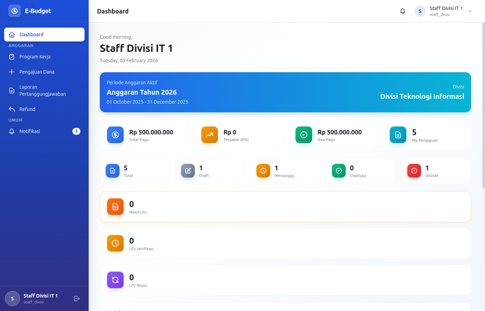
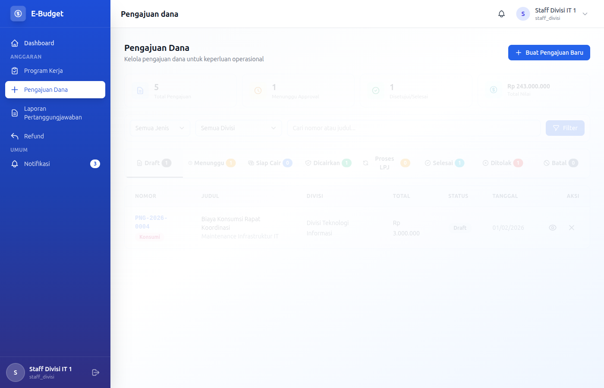
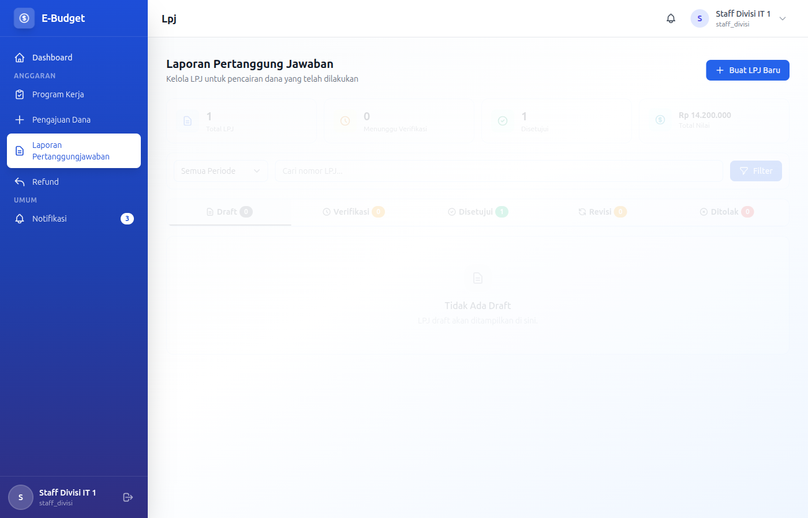

# eBudget Sederhana - Manual Staff Divisi

## Selamat Datang, Staff Divisi!

Sebagai **Staff Divisi**, Anda bertanggung jawab atas pengajuan dana untuk kegiatan divisi dan pembuatan laporan pertanggungjawaban (LPJ) setelah kegiatan selesai. Dokumen ini akan memandu Anda.

---

## Daftar Isi

1. [Login & Dashboard](#login--dashboard)
2. [Pengajuan Dana](#pengajuan-dana)
3. [Laporan Pertanggungjawaban (LPJ)](#laporan-pertanggungjawaban-lpj)
4. [Refund](#refund)
5. [Tracking Status](#tracking-status)

---

## Login & Dashboard

### Login ke Aplikasi

**Kredensial Login:**
- Email: `staff[angka].[divisi]@example.com` (contoh: staff1.it@example.com)
- Password: `password`

### Dashboard Overview



Sebagai Staff Divisi, dashboard menampilkan:
- Ringkasan pengajuan Anda
- Status approval yang pending
- Daftar LPJ yang harus dibuat
- Notifikasi penting

---

## Pengajuan Dana

### CRUD Pengajuan Dana

Sebagai Staff Divisi, Anda dapat **Create, Read, Update** pengajuan dana Anda sendiri. Delete hanya untuk draft.

### READ - Melihat Daftar Pengajuan Dana

Pengajuan Dana adalah permintaan dana untuk membiayai kegiatan atau program kerja divisi Anda.



1. Masuk ke menu **Pengajuan Dana**
2. Daftar pengajuan menampilkan:
   - Nomor pengajuan
   - Judul pengajuan
   - Program kerja terkait
   - Jenis pengajuan
   - Total pengajuan
   - Status
   - Tanggal pengajuan

**Filter yang tersedia:**
- Filter berdasarkan status
- Filter berdasarkan jenis pengajuan
- Filter berdasarkan program kerja
- Search berdasarkan judul/nomor pengajuan

**Status Pengajuan:**
| Status | Keterangan |
|--------|------------|
| **Draft** | Belum disubmit, masih bisa diedit |
| **Menunggu Approval** | Menunggu persetujuan Kepala Divisi |
| **Menunggu Pencairan** | Disetujui, menunggu pencairan |
| **Cair** | Dana sudah dicairkan |
| **Proses** | Sedang diproses |
| **Selesai** | Kegiatan selesai |
| **Ditolak** | Ditolak, lihat catatan |
| **Revisi** | Perlu direvisi sesuai catatan |
| **Cancelled** | Dibatalkan |

### CREATE - Membuat Pengajuan Dana Baru

1. Masuk ke menu **Pengajuan Dana**
2. Klik **Ajukan Dana Baru** / **Create Request**
3. Isi form dengan lengkap:

#### Informasi Dasar (Wajib)
- **Judul Pengajuan**: Judul kegiatan yang jelas (required)
- **Jenis Pengajuan**: Pilih jenis (required):
  - `kegiatan` - Kegiatan operasional
  - `pengadaan` - Pengadaan barang/jasa
  - `pembayaran` - Pembayaran tagihan
  - `honorarium` - Honorarium narasumber/tenaga ahli
  - `sewa` - Sewa tempat/peralatan
  - `konsumsi` - Konsumsi kegiatan
  - `reimbursement` - Penggantian biaya
  - `lainnya` - Lain-lain

- **Program Kerja**: Pilih proker terkait dari dropdown (required)
- **Deskripsi**: Jelaskan tujuan dan bentuk kegiatan (required)
  - Latar belakang kegiatan
  - Tujuan yang ingin dicapai
  - Bentuk pelaksanaan

#### Penerima Manfaat (Optional)
- **Nama Penerima**: Nama penerima dana (jika applicable)
- **Detail Penerima**: Informasi tambahan penerima

#### Rincian Penggunaan Dana (Wajib)
Klik **+ Tambah Rincian** untuk setiap item:

- **Uraian**: Deskripsi item (required)
  - Contoh: "Transport peserta", "Konsumsi coffee break", "Handout training"
- **Volume**: Jumlah yang dibutuhkan (required, numeric)
- **Satuan**: Satuan (required)
  - Contoh: pcs, kg, orang, hari, paket
- **Harga Satuan**: Harga per unit (required, numeric)
- **Subtotal**: Otomatis dihitung (volume × harga satuan)

Total pengajuan akan dihitung otomatis dari semua rincian.

#### Lampiran Dokumen
Upload dokumen pendukung (max 5 files):
- **Proposal kegiatan** (PDF) - required untuk kegiatan
- **Quotation/Price list** (PDF/JPG) - required untuk pengadaan
- **Surat undangan** (PDF) - jika relevan
- **Dokumen lain** (PDF/Excel/JPG) - optional

4. Klik **Simpan sebagai Draft** atau **Submit**

**Validation:**
- Minimal 1 rincian penggunaan dana
- Total pengajuan minimal Rp 1.000
- Dokumen pendukung sesuai jenis pengajuan
- Pastikan pagu anggaran divisi mencukupi

### UPDATE - Mengedit Pengajuan Draft/Revisi

Pengajuan dengan status **Draft** atau **Revisi** dapat diedit:

1. Pada daftar Pengajuan Dana, cari yang berstatus **Draft** atau **Revisi**
2. Klik tombol **Edit**
3. Lakukan perubahan:
   - Judul dan deskripsi
   - Jenis pengajuan
   - Program kerja
   - Rincian penggunaan dana (tambah/edit/hapus item)
   - Lampiran (tambah/hapus file)

4. Klik **Update** atau **Submit**

### DELETE/Cancel - Menghapus Pengajuan Draft

1. Klik tombol **Cancel** pada pengajuan draft
2. Konfirmasi pembatalan
3. Pengajuan akan berstatus "Cancelled"

> **Hanya pengajuan Draft atau Menunggu Approval** yang bisa dibatalkan.

### SPECIAL OPERATIONS

**Submit untuk Approval:**
1. Pastikan pengajuan sudah lengkap
2. Klik tombol **Submit**
3. Pengajuan akan dikirim ke Kepala Divisi untuk approval

**Print Pengajuan:**
1. Klik tombol **Print** pada pengajuan
2. PDF akan di-download
3. Bisa digunakan untuk arsip atau dokumen fisik

### Draft vs Submit

| Status | Keterangan |
|--------|------------|
| **Draft** | Disimpan sementara, belum dikirim ke Kepala Divisi |
| **Submit** | Sudah dikirim dan menunggu approval |

> **Tips**: Simpan sebagai Draft jika Anda ingin review lagi sebelum submit.

### Checklist Sebelum Submit

Sebelum submit pengajuan, pastikan:
- [ ] Nama kegiatan jelas dan spesifik
- [ ] Deskripsi menjelaskan tujuan kegiatan
- [ ] Jumlah dana yang wajar dan realistis
- [ ] Rincian penggunaan detail dan terperinci
- [ ] Lampiran dokumen lengkap
- [ ] Tanggal pelaksanaan sesuai
- [ ] Program kerja yang dipilih tepat

---

## Laporan Pertanggungjawaban (LPJ)

### CRUD LPJ

Sebagai Staff Divisi, Anda dapat **Create, Read, Update** LPJ untuk pencairan Anda. Delete hanya untuk draft.

### READ - Melihat Daftar LPJ

LPJ (Laporan Pertanggungjawaban) adalah dokumen yang wajib dibuat setelah kegiatan selesai.



1. Masuk ke menu **LPJ**
2. Daftar LPJ menampilkan:
   - Nomor LPJ
   - Judul laporan
   - Pengajuan terkait
   - Total digunakan
   - Sisa dana
   - Status
   - Tanggal submit

**Filter yang tersedia:**
- Filter berdasarkan status
- Filter berdasarkan periode anggaran
- Filter berdasarkan program kerja
- Search berdasarkan judul/nomor LPJ

**Status LPJ:**
| Status | Keterangan |
|--------|------------|
| **Draft** | Belum disubmit |
| **Pending** | Menunggu verifikasi |
| **Approved** | Disetujui, selesai |
| **Revisi** | Perlu diperbaiki |
| **Rejected** | Ditolak |

### Kapan Harus Membuat LPJ?

LPJ harus dibuat setelah:
- Dana berhasil dicairkan ke rekening/divisi
- Kegiatan sudah selesai dilaksanakan
- Semua transaksi terdokumentasi dengan bukti

**Deadline LPJ:** Maksimal 7 hari setelah kegiatan selesai.

### CREATE - Membuat LPJ Baru

1. Masuk ke menu **LPJ**
2. Klik **Buat LPJ Baru** / **Create LPJ**
3. Pilih **Pencairan Dana** terkait dari dropdown (required)
4. Isi form:

#### Informasi Kegiatan (Wajib)
- **Judul Laporan**: Judul laporan (required)
  - Contoh: "LPJ Kegiatan Training Staff IT", "LPJ Pengadaan Laptop"
- **Uraian Kegiatan**: Jelaskan pelaksanaan kegiatan (optional)
  - Tanggal dan lokasi pelaksanaan
  - Jumlah peserta
  - Aktivitas yang dilakukan
  - Hasil yang dicapai
  - Kendala yang dihadapi (jika ada)

#### Realisasi Pengeluaran (Wajib)
- **Total Digunakan**: Jumlah yang benar-benar digunakan (required, numeric, min: 0)
- **Sisa Dana**: Jumlah sisa (required, numeric, min: 0)
  - Otomatis dihitung: Jumlah Pencairan - Total Digunakan

#### Rincian Realisasi (Wajib)
Klik **+ Tambah Rincian** untuk setiap item:

- **Detail Pencairan**: Pilih detail pencairan terkait (required)
- **Uraian**: Deskripsi item realisasi (required)
- **Tanggal Realisasi**: Tanggal pengeluaran (required)
- **Volume Realisasi**: Jumlah aktual (required, numeric)
- **Harga Satuan**: Harga aktual (required, numeric)
- **Subtotal**: Otomatis dihitung

**Upload Bukti Pengeluaran per Rincian:**
- Klik tombol upload pada setiap rincian
- Upload bukti pengeluaran (PDF/JPG/PNG)
- Minimal 1 bukti per rincian

#### Penanganan Sisa Dana (Jika Ada)
Jika ada sisa dari dana yang dicairkan:
- **Jenis Penanganan**: Pilih opsi:
  - `Kembalikan ke Kas` - Dana dikembalikan
  - `Tambah ke LPJ Berikutnya` - Dipakai untuk kegiatan lain (sebutkan)

- **Bukti Pengembalian**: Upload bukti transfer jika mengembalikan (required jika memilih kembalikan)

5. Klik **Simpan sebagai Draft** atau **Submit**

**Validation:**
- Total digunakan tidak boleh melebihi jumlah pencairan
- Semua rincian harus ada bukti pengeluaran
- Sisa dana harus sesuai perhitungan
- Bukti pengeluaran harus jelas dan terbaca

### UPDATE - Mengedit LPJ Draft/Revisi

LPJ dengan status **Draft** atau **Revisi** dapat diedit:

1. Klik tombol **Edit** pada LPJ
2. Lakukan perbaikan:
   - Judul dan uraian
   - Total digunakan dan sisa dana
   - Rincian realisasi (tambah/edit/hapus)
   - Bukti pengeluaran (ganti/tambah)
   - Penanganan sisa dana

3. Klik **Update** atau **Submit**

### DELETE - Menghapus LPJ Draft

1. Klik tombol **Delete** pada LPJ draft
2. Konfirmasi penghapusan

### Format Bukti Pengeluaran

| Jenis Bukti | Format | Keterangan |
|-------------|--------|------------|
| Invoice/Kwitansi | PDF/JPG | Dari vendor/toko, asli |
| Bukti Transfer | JPG/PNG | Screenshot/mobile banking |
| Foto Kegiatan | JPG/PNG | Minimal 3 foto kegiatan |
| Rekapitulasi | Excel/PDF | Jika banyak item |

### Tips Membuat LPJ yang Baik

1. **Lengkap**: Dokumentasikan SEMUA pengeluaran
2. **Jelas**: Beri keterangan untuk setiap item
3. **Tertib**: Urutkan berdasarkan tanggal atau kategori
4. **Benar**: Pastikan jumlah sesuai dengan bukti

### Revisi LPJ

Jika LPJ diminta revisi:

1. Baca catatan revisi dari Kepala Divisi/Staff Keuangan
2. Klik **Edit** pada LPJ
3. Lakukan perbaikan:
   - Lengkapi dokumen yang kurang
   - Perbaiki rincian yang salah
   - Tambah penjelasan yang diminta
   - Ganti bukti yang tidak jelas

4. Submit ulang

---

## Refund

### CRUD Refund

Sebagai Staff Divisi, Anda dapat **Create, Read, Update** refund untuk LPJ dengan sisa dana.

### READ - Melihat Daftar Refund

1. Masuk ke menu **Refund**
2. Daftar refund menampilkan:
   - Nomor refund
   - LPJ terkait
   - Jumlah refund
   - Alasan refund
   - Status
   - Tanggal pengajuan

**Status Refund:**
| Status | Keterangan |
|--------|------------|
| **Draft** | Belum disubmit |
| **Pending** | Menunggu proses |
| **Approved** | Disetujui |
| **Processed** | Sudah ditransfer |
| **Rejected** | Ditolak |

### CREATE - Membuat Refund Baru

Refun dibuat dari LPJ yang memiliki sisa dana.

1. Masuk ke menu **Refund**
2. Klik **Ajukan Refund Baru**
3. Pilih LPJ dengan sisa dana dari dropdown
4. Isi form:
   - **Jumlah Refund**: Jumlah yang mau dikembalikan (required)
   - **Alasan Refund**: Alasan pengembalian (required)
   - **Metode Refund**: Pilih metode (required):
     - `transfer` - Transfer ke rekening
     - `tunai` - Cash

   - **Nama Bank**: Pilih bank (required jika transfer)
   - **Nomor Rekening**: Nomor rekening tujuan (required jika transfer)

5. Klik **Submit**

### UPDATE - Mengedit Refund Draft

1. Klik tombol **Edit** pada refund draft
2. Lakukan perubahan
3. Klik **Update**

---

## Tracking Status

### READ - Melihat Status Pengajuan

1. Masuk ke menu **Pengajuan Dana**
2. Lihat kolom **Status** untuk setiap pengajuan:
   - **Draft**: Belum disubmit
   - **Menunggu Approval**: Menunggu approval Kepala Divisi
   - **Approved**: Disetujui, menunggu pencairan
   - **Cair**: Dana sudah dicairkan
   - **Rejected**: Ditolak, lihat catatan

**Melihat Detail Status:**
1. Klik judul atau nomor pengajuan
2. Halaman detail menampilkan:
   - Informasi lengkap pengajuan
   - History approval lengkap
   - Siapa yang approve dan kapan
   - Catatan dari setiap approver

### READ - Melihat Status LPJ

1. Masuk ke menu **LPJ**
2. Lihat kolom **Status**:
   - **Draft**: Belum disubmit
   - **Pending**: Menunggu verifikasi
   - **Approved**: Selesai
   - **Revisi**: Perlu diperbaiki

### Notifikasi

Anda akan menerima notifikasi untuk:
- Pengajuan disetujui/ditolak
- Dana berhasil dicairkan
- LPJ disetujui/diminta revisi
- Approaching deadline LPJ (3 hari sebelum deadline)
- Refund diproses

---

## Alur Kerja Staff Divisi

### Siklus Pengajuan dan LPJ

```
1. Buat Pengajuan (Draft)
2. Review dan lengkapi data
3. Submit ke Kepala Divisi
4. Menunggu Approval Kepala Divisi
5. Menunggu Approval Direktur Keuangan (jika > threshold)
6. Dana Dicairkan (oleh Staff Keuangan)
7. Lakukan Kegiatan
8. Kumpulkan Bukti Pengeluaran selama kegiatan
9. Buat LPJ setelah kegiatan selesai
10. Submit LPJ untuk verifikasi
11. Selesai
```

---

## Tips untuk Staff Divisi

### Best Practices

1. **Ajukan Lebih Awal**
   - Jangan menunggu mendekati tanggal kegiatan
   - Beri waktu 3-5 hari kerja untuk approval
   - Perhatikan jam operasional keuangan

2. **Rincian yang Jelas**
   - Breakdown penggunaan dana se-detail mungkin
   - Hindari "lain-lain" terlalu banyak
   - Beri satuan yang jelas untuk setiap item

3. **Dokumentasi Selama Kegiatan**
   - Foto kegiatan saat berlangsung
   - Kumpulkan kwitansi/struk langsung
   - Catat pengeluaran harian di notebook/spreadsheet

4. **LPJ Tepat Waktu**
   - Buat LPJ maksimal 7 hari setelah kegiatan
   - Semakin cepat, semakin baik
   - Jangan tunggu deadline

5. **Jaga Sisa Dana**
   - Gunakan dana sesuai pengajuan
   - Kembalikan sisa dengan bukti yang jelas
   - Komunikasikan jika ada perubahan signifikan

---

## Troubleshooting

### Pengajuan Tidak Bisa Disubmit

- Cek apakah semua field wajib sudah terisi
- Pastikan lampiran diupload
- Pastikan pagu anggaran masih mencukupi
- Cek apakah ada pending LPJ refund
- Hubungi Kepala Divisi atau admin

### Pengajuan Ditolak

- Baca catatan penolakan dengan teliti
- Perbaiki sesuai masukan
- Submit ulang setelah revisi
- Diskusikan dengan Kepala Divisi jika tidak jelas

### Tidak Bisa Membuat LPJ

- Pastikan pencairan dana sudah successful
- Cek apakah LPJ untuk pencairan tersebut sudah ada
- Hubungi admin jika issue sistem

### LPJ Diminta Revisi

- Baca catatan revisi dengan teliti
- Lengkapi kekurangan dokumen
- Perbaiki kesalahan data
- Tambah penjelasan yang diminta
- Submit ulang

### Bukti Pengeluaran Hilang

- Jika kwitansi hilang:
  - Buat surat keterangan dari vendor/toko
  - Surat harus ditandatangani dan bermaterai
  - Lampirkan bukti transfer (jika ada)

- Jika bukti transfer hilang:
  - Cek mutasi rekening di mobile banking
  - Screenshot mutasi sebagai bukti

### Lupa Password

- Hubungi Kepala Divisi atau Superadmin
- Request reset password
- Password baru akan dikirim ke email

---

## Kewajiban Hukum

Sebagai Staff Divisi, Anda bertanggung jawab atas:
- Kebenaran informasi dalam pengajuan
- Kebenaran jumlah pengeluaran di LPJ
- Keaslian bukti pengeluaran yang dilampirkan
- Pengembalian sisa dana (jika ada)
- Kepatuhan terhadap timeline yang ditetapkan

---

## FAQ

### Berapa lama approval pengajuan?

Biasanya 1-3 hari kerja, tergantung Kepala Divisi dan Direktur Keuangan. Untuk jumlah besar, bisa memakan waktu lebih lama.

### Apa yang terjadi jika ada sisa dana?

Sisa dana harus dikembalikan atau dipakai untuk kegiatan lain dengan izin. Jika dikembalikan, bukti transfer harus dilampirkan.

### Bolehkah satu pengajuan untuk banyak kegiatan?

Boleh, asal kegiatan terkait dan dalam periode yang sama. Jelaskan semua kegiatan dalam deskripsi.

### Bagaimana jika kwitansi hilang?

Buat surat keterangan dari vendor/toko yang ditandatangani dan bermaterai. Lampirkan bukti transfer sebagai pendukung.

### Berapa batas waktu membuat LPJ?

Maksimal 7 hari setelah kegiatan selesai. Sistem akan mengingatkan 3 hari sebelum deadline.

### Bolehkah mengedit pengajuan yang sudah disubmit?

Tidak bisa langsung. Jika perlu perubahan, batalkan pengajuan (jika masih menunggu approval) atau buat pengajuan baru.

---

*Dokumentasi ini khusus untuk role Staff Divisi eBudget Sederhana*
*Versi: 1.0 | Terakhir update: Februari 2026*
