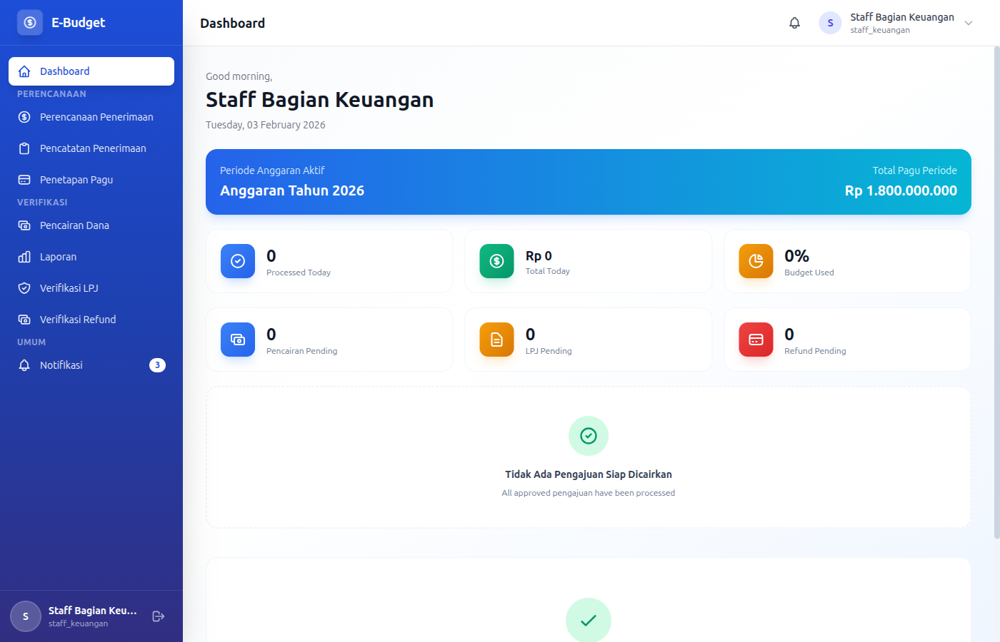
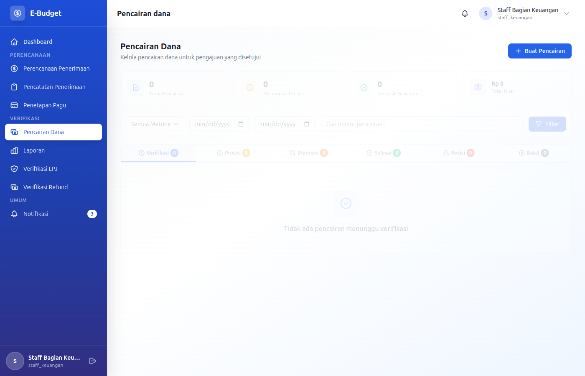
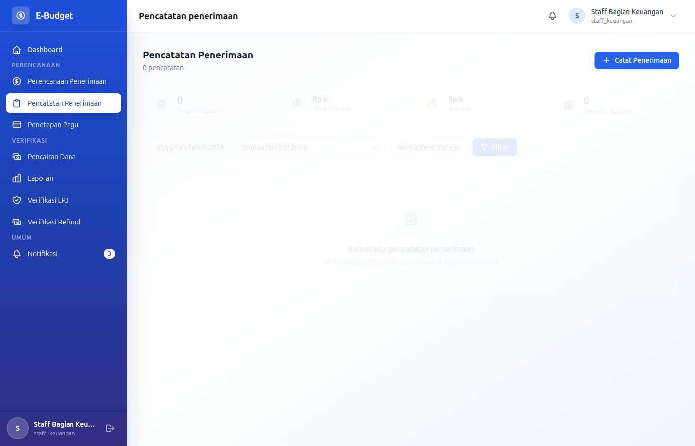

# eBudget Sederhana - Manual Staff Keuangan

## Selamat Datang, Staff Keuangan!

Sebagai **Staff Keuangan**, Anda adalah ujung tombak operasional keuangan yang bertanggung jawab atas pencairan dana dan pencatatan penerimaan. Dokumen ini akan memandu Anda.

---

## Daftar Isi

1. [Login & Dashboard](#login--dashboard)
2. [Pencairan Dana](#pencairan-dana)
3. [Pencatatan Penerimaan](#pencatatan-penerimaan)
4. [Verifikasi LPJ](#verifikasi-lpj)
5. [Proses Refund](#proses-refund)
6. [Prosedur Operasional](#prosedur-operasional)

---

## Login & Dashboard

### Login ke Aplikasi

**Kredensial Login:**
- Email: `staff.keuangan@example.com`
- Password: `password`

### Dashboard Overview

Sebagai Staff Keuangan, dashboard menampilkan:
- Ringkasan dana yang harus dicairkan
- Status pencairan yang pending
- Total penerimaan hari ini
- Notifikasi penting

---

## Pencairan Dana

### CRUD Pencairan Dana

Sebagai Staff Keuangan, Anda memiliki akses untuk **Create, Read, Update** pencairan dana. Delete/Cancel hanya untuk pending.

### READ - Melihat Daftar Pencairan Dana

Pencairan Dana adalah proses mengirimkan dana dari rekening perusahaan ke penerima setelah pengajuan disetujui.

1. Masuk ke menu **Pencairan Dana**
2. Daftar pencairan menampilkan:
   - Nomor pencairan
   - Nomor pengajuan terkait
   - Nama penerima
   - Jumlah pencairan
   - Metode pencairan
   - Status
   - Tanggal pencairan

**Filter yang tersedia:**
- Filter berdasarkan status
- Filter berdasarkan metode pencairan
- Filter berdasarkan tanggal
- Search berdasarkan nomor/nama penerima

**Status Pencairan:**
| Status | Keterangan |
|--------|------------|
| **Siap Dicairkan** | Sudah approved, menunggu dicairkan |
| **Sedang Diproses** | Sedang ditransfer |
| **Berhasil** | Dana berhasil ditransfer |
| **Gagal** | Transfer gagal, perlu retry |
| **Dibatalkan** | Pencairan dibatalkan |

### CREATE - Melakukan Pencairan Dana Baru

1. Masuk ke menu **Pencairan Dana**
2. Filter daftar dengan:
   - Status: **Siap Dicairkan**
   - Periode anggaran aktif

3. Klik tombol **Cairkan** / **Process** pada pengajuan yang akan dicairkan
4. Form pencairan akan muncul:

**Informasi Penerima (Wajib):**
- **Nama Penerima**: Otomatis terisi dari pengajuan (readonly)
- **Nomor Rekening**: Rekening tujuan transfer (required)
- **Nama Bank**: Pilih bank dari dropdown (required)
  - BCA, BNI, BRI, Mandiri, CIMB, dll
- **Berita Transfer**: Keterangan untuk penerima (optional)

**Detail Pencairan (Wajib):**
- **Jumlah yang Dicairkan**: Otomatis terisi sesuai yang disetujui (readonly)
- **Metode Pencairan**: Pilih metode (required):
  - `transfer` - Transfer bank
  - `tunai` - Cash

- **Tanggal Pencairan**: Tanggal transfer (required)
- **Bukti Transfer**: Upload bukti (PDF/JPG/PNG, max 5MB)

5. Klik **Simpan Pencairan** / **Save**

**Validation:**
- Nomor rekening harus diisi
- Nama bank harus dipilih
- Tanggal pencairan harus diisi
- Bukti transfer harus diupload

### UPDATE - Mengupdate Pencairan Pending

Pencairan dengan status **Siap Dicairkan** atau **Sedang Diproses** dapat diupdate:

1. Klik tombol **Edit** pada pencairan
2. Lakukan perubahan:
   - Nomor rekening
   - Nama bank
   - Metode pencairan
   - Upload/replace bukti transfer

3. Klik **Update**

### SPECIAL OPERATIONS

**Upload Bukti Transfer:**
Format yang diterima:
- **PDF**: Bukti transfer dari e-banking
- **JPG/PNG**: Screenshot bukti transfer

Pastikan bukti transfer menampilkan:
- Nama penerima (jika ada di bukti)
- Jumlah yang ditransfer
- Tanggal transfer
- Nomor referensi (jika ada)

**Proses Pembayaran (Process Payment):**
1. Setelah transfer dilakukan, upload bukti transfer
2. Klik **Proses Pembayaran** / **Mark as Complete**
3. Status akan berubah menjadi "Berhasil"
4. Notifikasi akan dikirim ke penerima

**Retry Pencairan Gagal:**
Jika pencairan gagal:
1. Klik tombol **Retry** pada pencairan yang gagal
2. Cek kembali nomor rekening dan nama bank
3. Lakukan transfer ulang
4. Upload bukti transfer baru
5. Klik **Update**

**Cancel Pencairan (Pending Only):**
1. Klik tombol **Cancel** pada pencairan pending
2. Konfirmasi pembatalan
3. Pencairan akan berstatus "Dibatalkan"
4. Pengajuan akan kembali ke status "Menunggu Pencairan"

### BULK OPERATIONS

**Pencairan Batch:**
Untuk mencairkan banyak pengajuan sekaligus:

1. Pilih pengajuan dengan checkbox
2. Klik **Cairkan Terpilih** / **Process Selected**
3. Daftar pengajuan yang dipilih akan muncul
4. Lakukan transfer untuk masing-masing:
   - Buka detail untuk setiap pengajuan
   - Lakukan transfer
   - Upload bukti transfer
   - Proses pembayaran

5. Ulangi untuk semua pengajuan

---

## Pencatatan Penerimaan

### CRUD Pencatatan Penerimaan

Sebagai Staff Keuangan, Anda dapat **Create, Read, Update** pencatatan penerimaan. Delete hanya sebelum reconcile.

### READ - Melihat Daftar Penerimaan

Pencatatan Penerimaan adalah mencatat semua dana yang masuk ke perusahaan.

1. Masuk ke menu **Pencatatan Penerimaan**
2. Daftar penerimaan menampilkan:
   - Nomor penerimaan
   - Jenis penerimaan
   - Sumber dana
   - Jumlah
   - Tanggal
   - Periode anggaran (jika relevan)
   - Status

**Filter yang tersedia:**
- Filter berdasarkan jenis penerimaan
- Filter berdasarkan periode anggaran
- Filter berdasarkan tanggal
- Search berdasarkan sumber/keterangan

### CREATE - Mencatat Penerimaan Baru

1. Masuk ke menu **Pencatatan Penerimaan**
2. Klik **Catat Penerimaan Baru** / **Record Receipt**
3. Isi form:

**Informasi Penerimaan (Wajib):**
- **Jenis Penerimaan**: Pilih jenis (required):
  - `Pengembalian Sisa Dana` - Sisa dari LPJ
  - `Dana Tambahan` - Tambahan modal/anggaran
  - `Pendapatan Lain` - Pendapatan operasional

- **Sumber Dana**: Asal dana (required)
  - Contoh: "LPJ Training Staff", "Inject Dana Owner", "Bunga Bank"

- **Jumlah**: Nominal yang diterima (required, numeric, min: 0)
- **Tanggal**: Tanggal dana diterima (required)
- **Keterangan**: Deskripsi singkat (optional)

**Periode Anggaran (Optional):**
- **Periode Anggaran**: Pilih periode (jila relevan)
  - Required untuk Pengembalian Sisa Dana

**Bukti Penerimaan (Wajib):**
Upload bukti (max 5 files):
- Mutasi bank (PDF/JPG)
- Kwitansi penerimaan
- Bukti transfer masuk
- Slip setoran

4. Pilih **Periode Anggaran** (jika relevan)
5. Klik **Simpan** / **Save**

**Validation:**
- Jenis penerimaan harus dipilih
- Sumber dana harus diisi
- Jumlah harus lebih dari 0
- Bukti penerimaan harus diupload

### UPDATE - Mengedit Pencatatan

1. Klik tombol **Edit** pada pencatatan yang diinginkan
2. Ubah informasi yang diperlukan:
   - Jenis penerimaan
   - Sumber dana
   - Jumlah
   - Tanggal
   - Keterangan
   - Bukti penerimaan (tambah/ganti)

3. Klik **Update**

> **Catatan:** Pencatatan yang sudah direconcile tidak dapat diubah.

### DELETE - Menghapus Pencatatan

1. Klik tombol **Hapus** / **Delete** pada pencatatan
2. Konfirmasi penghapusan

**Batasan Delete:**
- Hanya pencatatan yang belum direconcile yang bisa dihapus
- Hubungi Direktur Keuangan untuk unlock jika perlu menghapus yang sudah reconcile

### Jenis Penerimaan

| Jenis | Deskripsi | Contoh |
|-------|-----------|--------|
| **Pengembalian Sisa Dana** | Sisa dari LPJ | Sisa dana kegiatan training |
| **Dana Tambahan** | Tambahan modal/anggaran | Inject dana dari owner |
| **Pendapatan Lain** | Pendapatan operasional | Bunga bank, dll |

---

## Verifikasi LPJ

### READ - Melihat LPJ untuk Verifikasi

Sebagai Staff Keuangan, Anda dapat memverifikasi LPJ dari semua divisi.

1. Masuk ke menu **LPJ**
2. Cari LPJ dengan status **Pending**
3. Klik untuk melihat detail

**Yang Diverifikasi:**
- Kelengkapan bukti pengeluaran
- Kesesuaian jumlah dengan bukti
- Kecukupan dokumentasi
- Penanganan sisa dana

### UPDATE - Verifikasi LPJ

1. Klik tombol **Review** pada LPJ pending
2. Review detail LPJ:
   - Total pengeluaran aktual
   - Rincian realisasi
   - Bukti pengeluaran per rincian
   - Sisa dana dan penanganannya

3. Pilih aksi:
   - **Setuju (Approve)** - Jika semua lengkap dan sesuai
   - **Minta Revisi (Request Revision)** - Jika ada kekurangan

4. Jika meminta revisi, isi alasan (required):
   - Bukti tidak lengkap
   - Jumlah tidak sesuai
   - Perlu clarification
   - Lainnya (sebutkan)

5. Klik **Konfirmasi**

---

## Proses Refund

### READ - Melihat Daftar Refund

1. Masuk ke menu **Refund**
2. Daftar refund menampilkan:
   - Nomor refund
   - LPJ terkait
   - Pengaju
   - Jumlah refund
   - Metode refund
   - Status

**Status Refund:**
| Status | Keterangan |
|--------|------------|
| **Pending** | Menunggu proses |
| **Approved** | Disetujui, siap diproses |
| **Processed** | Sudah ditransfer |
| **Rejected** | Ditolak |

### UPDATE - Memproses Refund

1. Klik tombol **Proses** pada refund yang approved
2. Lakukan transfer sesuai metode:
   - Transfer ke rekening yang ditentukan
   - Atau serahkan cash (jika tunai)

3. Upload bukti transfer (required)
4. Klik **Konfirmasi Proses**
5. Status refund akan berubah menjadi "Processed"

---

## Prosedur Operasional

### Alur Kerja Harian

#### Pagi Hari
1. Cek daftar pencairan yang **Siap Dicairkan**
2. Prioritaskan pencairan mendesak
3. Siapkan dana di rekening (cek saldo)

#### Siang Hari
1. Lakukan transfer sesuai daftar
2. Upload bukti transfer untuk masing-masing
3. Catat penerimaan jika ada dana masuk
4. Proses refund yang approved

#### Sore Hari
1. Review pencairan hari ini
2. Rekonkiliasi dengan mutasi bank
3. Catat penerimaan hari ini
4. Update status yang pending

### Rekonkiliasi Harian

Setiap hari kerja, lakukan rekonkiliasi:

1. **Download Mutasi Bank**
   - Login ke e-banking
   - Download mutasi hari ini
   - Simpan sebagai PDF/Excel

2. **Cocokkan dengan Pencairan**
   - Bandingkan mutasi dengan pencairan di sistem
   - Pastikan semua transfer tercatat
   - Cek jumlah yang sesuai

3. **Cocokkan dengan Penerimaan**
   - Bandingkan mutasi masuk dengan penerimaan
   - Pastikan semua penerimaan tercatat

4. **Catat Selisih (Jika Ada)**
   - Jika ada selisih, buat pencatatan adjustment
   - Beritahu Direktur Keuangan

### Ceklis Sebelum Transfer

Sebelum melakukan transfer, pastikan:
- [ ] Rekening tujuan benar
- [ ] Jumlah yang ditransfer sesuai
- [ ] Saldo rekening mencukupi
- [ ] Catat nomor referensi transfer
- [ ] Simpan bukti transfer

### Menangani Masalah

#### Transfer Gagal

1. Cek penyebab:
   - Rekening tujuan salah/tutup
   - Saldo tidak cukup
   - Bank gangguan
   - Limit transfer harian terlampaui

2. Beritahu Direktur Keuangan
3. Update status pencairan di sistem
4. Retry setelah issue resolved

#### Bukti Transfer Hilang

1. Cek e-banking untuk download ulang
2. Request ke bank jika tidak ada di e-banking
3. Gunakan mutasi bank sebagai alternatif

#### Selisih Jumlah

1. Cek kembali jumlah di sistem
2. Cek mutasi bank
3. Buat catatan selisih
4. Beritahu Direktur Keuangan
5. Buat adjustment jika perlu

#### Rekening Salah

1. Hubungi penerima untuk konfirmasi
2. Jika sudah ditransfer ke rekening salah:
   - Klaim ke bank (jika baru saja)
   - Minta pengembalian dari penerima salah
3. Retry ke rekening yang benar

---

## Tips untuk Staff Keuangan

### Best Practices

1. **Transfer Tepat Waktu**
   - Lakukan transfer pada jam operasional banking (Senin-Jumat, 08:00-15:00)
   - Hindari transfer di luar jam kerja
   - Hindari transfer di hari libur (kecuali instruksi khusus)

2. **Dokumentasi Lengkap**
   - Selalu upload bukti transfer
   - Simpan bukti di folder terpisah per bulan
   - Backup secara rutin

3. **Cek Berkala**
   - Cek rekening harian
   - Review pencairan pending tiap 2 jam
   - Rekonkiliasi harian sebelum pulang
   - Rekonkiliasi mingguan dengan Direktur Keuangan

4. **Komunikasi**
   - Beritahu penerima via email/WA jika sudah ditransfer
   - Konfirmasi jika ada masalah
   - Update status secara real-time
   - Reply pertanyaan dengan cepat

5. **Keamanan**
   - Jangan share password ke siapapun
   - Logout setelah selesai kerja
   - Jangan simpan bukti di tempat sembarangan
   - Lock computer saat meninggalkan meja

---

## Troubleshooting

### Tidak Bisa Cairkan Dana

- Pastikan pengajuan sudah approved
- Cek apakah periode anggaran aktif
- Cek apakah pencairan sudah pernah dilakukan
- Hubungi Direktur Keuangan jika ada issue

### Bukti Transfer Tidak Bisa Diupload

- Cek ukuran file (maks. 5MB)
- Pastikan format PDF/JPG/PNG
- Compress jika file terlalu besar
- Cek koneksi internet

### Tidak Bisa Edit Pencatatan

- Pencatatan mungkin sudah direconcile
- Hubungi Direktur Keuangan untuk unlock
- Buat pencatatan adjustment jika perlu

### Transfer Gagal Terus

- Cek koneksi internet
- Cek apakah bank sedang gangguan
- Cek limit transfer harian
- Hubungi bank jika perlu

### Lupa Password

- Hubungi Direktur Keuangan atau Superadmin
- Request reset password

---

## Kewajiban Hukum

Sebagai Staff Keuangan, Anda bertanggung jawab atas:
- Kebenaran jumlah pencairan
- Keamanan dana perusahaan
- Kelengkapan bukti transfer
- Kepatuhan SOP keuangan
- Kerahasiaan data keuangan

---

## FAQ

### Berapa lama proses pencairan?

Biasanya 1 hari kerja setelah approval, tergantung jam transfer. Transfer sebelum jam 14:00 biasanya proses hari yang sama.

### Bagaimana jika transfer gagal?

Cek penyebab, update status di sistem ke "Gagal", dan retry setelah issue resolved.

### Bolehkah transfer di hari libur?

Hindari transfer di hari libur karena bank offline. Kecuali ada instruksi khusus dari Direktur Keuangan.

### Bagaimana menangani permintaan transfer mendesak?

Prioritaskan sesuai instruksi Direktur Keuangan, tetap ikuti SOP. Jika sangat mendesak, hubungi Direktur Keuangan dulu.

### Apa yang terjadi jika salah transfer?

Hubungi bank secepatnya untuk klaim. Jika tidak bisa, koordinasi dengan penerima salah untuk pengembalian.

### Berapa batas waktu rekonkiliasi?

Rekonkilasi harian harus dilakukan setiap hari sebelum pulang kerja. Rekonkiliasi mingguan dengan Direktur Keuangan setiap Jumat sore.

---

*Dokumentasi ini khusus untuk role Staff Keuangan eBudget Sederhana*
*Versi: 1.0 | Terakhir update: Februari 2026*
