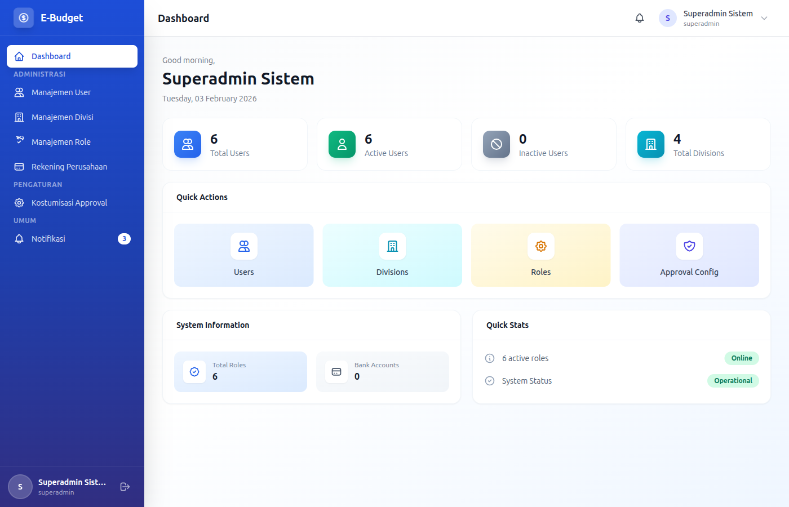

# eBudget Sederhana - Manual Superadmin

## Selamat Datang, Superadmin!

Sebagai **Superadmin**, Anda memiliki akses penuh ke seluruh sistem eBudget Sederhana. Dokumen ini akan memandu Anda dalam mengelola sistem.

---

## Daftar Isi

1. [Login & Dashboard](#login--dashboard)
2. [Manajemen User](#manajemen-user)
3. [Manajemen Role & Permission](#manajemen-role--permission)
4. [Manajemen Divisi](#manajemen-divisi)
5. [Monitoring & Laporan](#monitoring--laporan)
6. [Pengaturan Sistem](#pengaturan-sistem)

---

## Login & Dashboard

### Login ke Aplikasi

**Kredensial Login:**
- Email: `superadmin@example.com`
- Password: `password`

### Dashboard Overview

Sebagai Superadmin, dashboard menampilkan:
- Ringkasan seluruh anggaran perusahaan
- Statistik pengajuan dana semua divisi
- Status pencairan dan LPJ
- Notifikasi aktivitas sistem
- Akses cepat ke semua modul

---

## Manajemen User

### CRUD User

Sebagai Superadmin, Anda memiliki akses penuh untuk **Create, Read, Update, Delete** user.

### READ - Melihat Daftar User

1. Masuk ke menu **Users** (melalui Settings)
2. Daftar user menampilkan:
   - Nama lengkap
   - Username
   - Email
   - Role(s)
   - Divisi (jika applicable)
   - Status aktif/tidak
   - Tanggal dibuat

**Filter yang tersedia:**
- Filter berdasarkan role
- Filter berdasarkan divisi
- Search berdasarkan nama/email
- Filter berdasarkan status (aktif/non-aktif)

### CREATE - Menambah User Baru

1. Masuk ke menu **Users**
2. Klik **Tambah User** / **Create User**
3. Isi form:

**Informasi Dasar (Wajib):**
- **Nama Lengkap**: Nama lengkap user (required)
- **Full Name**: Nama untuk tampilan (required)
- **Username**: Unique untuk login (optional, nullable)
- **Email**: Email unik untuk login (required)
- **Password**: Min 8 karakter (required)

**Role & Divisi:**
- **Role(s)**: Pilih satu atau lebih role:
  - `superadmin` - Akses penuh
  - `direktur_utama` - Approval tertinggi
  - `direktur_keuangan` - Manajemen keuangan
  - `kepala_divisi` - Manajemen divisi
  - `staff_divisi` - Staff divisi
  - `staff_keuangan` - Staff keuangan
- **Divisi(s)**: Pilih divisi untuk role staff_divisi (multiple)

**Profil:**
- **Avatar**: Upload foto profil (max 2MB, format JPG/PNG)
- **Is Active**: Toggle aktif/non-aktif

4. Klik **Simpan** / **Save**

5. Sistem akan:
   - Mengirim email welcome ke user baru
   - Menetapkan role dan divisi
   - Membuat akun user

### UPDATE - Mengedit User

1. Pada daftar Users, klik tombol **Edit** pada user yang diinginkan
2. Form edit akan muncul dengan semua field yang bisa diubah:
   - Nama lengkap
   - Username
   - Email
   - Password (opsional - kosongkan jika tidak ingin mengubah)
   - Role(s)
   - Divisi(s)
   - Avatar
   - Status aktif/non-aktif

3. Lakukan perubahan yang diperlukan
4. Klik **Update**

**Ketentuan Update:**
- Password bersifat opsional saat edit
- Role dan divisi bisa diubah kapan saja
- User akan logout otomatis jika role diubah saat sedang login
- Avatar akan di-generate otomatis dari inisial nama jika tidak diupload

### DELETE - Menghapus User

1. Klik tombol **Hapus** / **Delete** pada user yang diinginkan
2. Konfirmasi penghapusan pada dialog yang muncul
3. Sistem akan melakukan soft delete:
   - User ditandai sebagai deleted
   - Data tidak benar-benar dihapus dari database
   - User tidak bisa login setelah dihapus

**Batasan Delete:**
- Tidak bisa menghapus user yang memiliki data terkait (pengajuan, LPJ, dll)
- User akan dinonaktifkan terlebih dahulu jika memiliki data

### RESET PASSWORD

1. Klik tombol **Reset Password** pada user
2. Sistem akan generate password baru
3. Password baru akan dikirim ke email user

### TOGGLE STATUS

1. Klik tombol toggle **Aktif/Non-aktif** pada user
2. User akan langsung kehilangan/gaining akses login

---

## Manajemen Role & Permission

### Role di Sistem

Sistem memiliki 6 role:

| Role | Kode | Keterangan |
|------|------|-----------|
| **Superadmin** | `superadmin` | Akses penuh (Anda) |
| **Direktur Utama** | `direktur_utama` | Approval & laporan tertinggi |
| **Direktur Keuangan** | `direktur_keuangan` | Perencanaan & oversight keuangan |
| **Kepala Divisi** | `kepala_divisi` | Manajemen divisi |
| **Staff Divisi** | `staff_divisi` | Staff divisi |
| **Staff Keuangan** | `staff_keuangan` | Staff keuangan/kasir |

### Permissions

Setiap role memiliki permission spesifik. Sebagai Superadmin, Anda dapat:
- Melihat semua permission
- Mengedit permission role
- Membuat permission baru

---

## Manajemen Divisi

### CRUD Divisi

Sebagai Superadmin, Anda memiliki akses penuh untuk **Create, Read, Update, Delete** divisi.

### READ - Melihat Daftar Divisi

1. Masuk ke menu **Divisi**
2. Daftar divisi menampilkan:
   - Kode divisi
   - Nama divisi
   - Singkatan
   - Deskripsi
   - Jumlah user
   - Status aktif/tidak

**Filter yang tersedia:**
- Search berdasarkan nama/kode divisi
- Filter berdasarkan status

### CREATE - Menambah Divisi Baru

1. Masuk ke menu **Divisi**
2. Klik **Tambah Divisi** / **Create Division**
3. Isi form:

**Informasi Divisi (Wajib):**
- **Kode Divisi**: Kode unik untuk divisi (required, unique)
- **Nama Divisi**: Nama lengkap divisi (required)
- **Singkatan**: Singkatan divisi (optional)
- **Deskripsi**: Deskripsi singkat divisi (optional)

4. Klik **Simpan** / **Save**

**Validation:**
- Kode divisi harus unik
- Nama divisi harus unik

### UPDATE - Mengedit Divisi

1. Pada daftar Divisi, klik tombol **Edit** pada divisi yang diinginkan
2. Form edit akan muncul dengan semua field yang bisa diubah:
   - Kode divisi (jika belum ada data terkait)
   - Nama divisi
   - Singkatan
   - Deskripsi

3. Lakukan perubahan yang diperlukan
4. Klik **Update**

**Ketentuan Update:**
- Kode divisi tidak bisa diubah jika ada data terkait (pengajuan, program kerja, dll)
- Nama divisi bisa diubah kapan saja

### DELETE - Menghapus Divisi

1. Klik tombol **Hapus** / **Delete** pada divisi yang diinginkan
2. Konfirmasi penghapusan pada dialog yang muncul
3. Sistem akan melakukan soft delete:
   - Divisi ditandai sebagai deleted
   - Data tidak benar-benar dihapus dari database

**Batasan Delete:**
- Tidak bisa menghapus divisi yang memiliki user
- Tidak bisa menghapus divisi yang memiliki data terkait (program kerja, pengajuan, dll)

### JOB POSITION MANAGEMENT

Setiap divisi dapat memiliki multiple job positions (posisi/jabatan):

**Create Job Position:**
1. Masuk ke detail divisi
2. Klik tab **Job Positions**
3. Klik **Tambah Position**
4. Isi nama jabatan
5. Klik **Simpan**

**Edit Job Position:**
1. Klik tombol **Edit** pada job position
2. Ubah nama jabatan
3. Klik **Update**

**Delete Job Position:**
1. Klik tombol **Hapus** pada job position
2. Konfirmasi penghapusan

---

## Manajemen Program Kerja

### CRUD Program Kerja

Sebagai Superadmin, Anda memiliki akses penuh untuk **Create, Read, Update, Delete** program kerja.

### READ - Melihat Daftar Program Kerja

1. Masuk ke menu **Program Kerja**
2. Daftar program kerja menampilkan:
   - Kode program
   - Nama program
   - Divisi
   - Periode anggaran
   - Target output
   - Status (active, inactive, suspended)
   - Total pagu
   - Sisa pagu

**Filter yang tersedia:**
- Filter berdasarkan divisi
- Filter berdasarkan status
- Filter berdasarkan periode anggaran
- Search berdasarkan nama/kode program

### CREATE - Menambah Program Kerja Baru

1. Masuk ke menu **Program Kerja**
2. Klik **Tambah Program Kerja** / **Create Program**
3. Isi form:

**Informasi Program (Wajib):**
- **Kode Program**: Kode unik untuk program (required, unique)
- **Nama Program**: Nama lengkap program (required, max 255 karakter)
- **Divisi**: Pilih divisi pemilik program (required)
- **Periode Anggaran**: Pilih periode anggaran (required)

**Detail Program:**
- **Target Output**: Target yang ingin dicapai (optional)
- **Tanggal Mulai**: Perkiraan tanggal mulai (optional)
- **Tanggal Selesai**: Perkiraan tanggal selesai (optional)
- **Deskripsi**: Deskripsi program (optional)

4. Klik **Simpan** / **Save**

5. Setelah dibuat, Anda bisa menambahkan detail anggaran (pagu) untuk program ini.

### UPDATE - Mengedit Program Kerja

1. Pada daftar Program Kerja, klik tombol **Edit** pada program yang diinginkan
2. Form edit akan muncul dengan semua field yang bisa diubah

3. Lakukan perubahan yang diperlukan
4. Klik **Update**

**Ketentuan Update:**
- Program hanya bisa diedit pada periode perencanaan
- Program tidak bisa diedit saat periode penggunaan
- Status program bisa diubah (active, inactive, suspended)

### DELETE - Menghapus Program Kerja

1. Klik tombol **Hapus** / **Delete** pada program kerja yang diinginkan
2. Konfirmasi penghapusan

**Batasan Delete:**
- Hanya program dengan status draft bisa dihapus
- Tidak bisa menghapus program yang ada sub-program
- Tidak bisa menghapus program yang sudah memiliki detail anggaran

### SPECIAL OPERATIONS

**Activate Program:**
1. Klik tombol **Activate** pada program
2. Program akan menjadi aktif dan bisa digunakan untuk pengajuan

**Suspend Program:**
1. Klik tombol **Suspend** pada program
2. Program akan ditangguhkan dan tidak bisa digunakan untuk pengajuan baru

---

## Monitoring & Laporan

### Akses ke Semua Laporan

Sebagai Superadmin, Anda memiliki akses ke:
- Semua laporan divisi
- Laporan keuangan
- Laporan eksekutif
- Export data dalam berbagai format (Excel, PDF)

### Monitoring Aktivitas

Anda dapat memantau:
- Aktivitas login user
- Riwayat pengajuan dana
- Riwayat pencairan
- Audit trail sistem

---

## Pengaturan Sistem

### Konfigurasi Sistem

Akses melalui menu **Settings** untuk:
- Konfigurasi periode anggaran aktif
- Pengaturan approval level
- Konfigurasi notifikasi
- Backup data
- Restore data

---

## Tips untuk Superadmin

### Best Practices

1. **Password Security**
   - Gunakan password yang kuat
   - Ganti password secara berkala

2. **User Management**
   - Berikan role sesuai tanggung jawab
   - Hapus user yang tidak aktif
   - Review permission secara berkala

3. **Data Backup**
   - Backup database secara rutin
   - Simpan backup di lokasi aman

4. **Monitoring**
   - Review aktivitas sistem harian
   - Perhatikan pengajuan dana besar
   - Monitor penggunaan storage

---

## Troubleshooting

### Tidak Bisa Mengakses Halaman Tertentu

- Pastikan Anda sudah login sebagai superadmin
- Clear cache browser
- Cek koneksi internet

### User Tidak Dapat Login

- Pastikan akun user aktif
- Reset password jika lupa
- Cek role user tersebut

---

## Kontak Support

Sebagai Superadmin, Anda adalah contact utama untuk:
- Issue teknis sistem
- Laporan bug
- Permintaan fitur baru

---

*Dokumentasi ini khusus untuk role Superadmin eBudget Sederhana*
*Versi: 1.0 | Terakhir update: Februari 2026*
